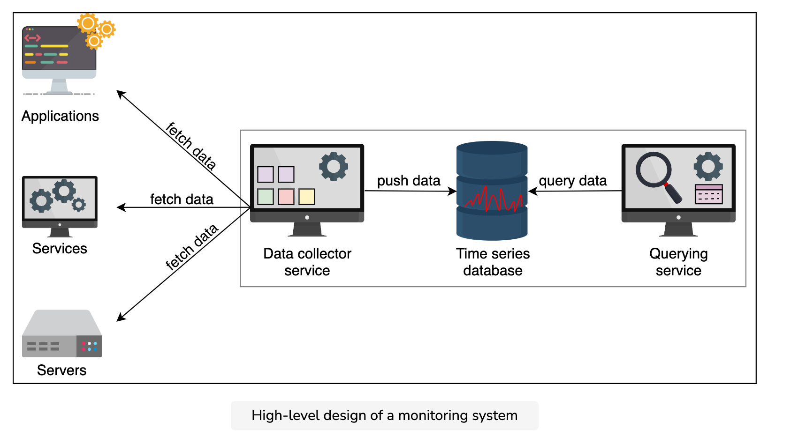
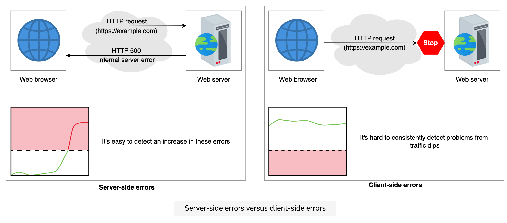

### Metrics & alerting
A good monitoring system needs to clearly define what to measure and in what units (metrics). The monitoring system also needs to define threshold values of all metrics and the ability to inform appropriate stakeholders (alerts) when values are out of acceptable ranges. Knowing the state of our infrastructure and systems ensures service stability. The support team can respond to issues more quickly and confidently if they have access to information on the health and performance of the deployments. Monitoring systems that collect measurements, show data, and send warnings when something appears wrong are helpful for the support team.

#### Alerting
Alerting is the part of a monitoring system that responds to changes in metric values and takes action. There are two components to an alert definition: a metrics-based condition or threshold, and an action to take when the values fall outside of the permitted range.

#### Requirements
Let’s sum up what we want our monitoring system to do for us:

* Monitor critical local processes on a server for crashes.

* Monitor any anomalies in the use of CPU/memory/disk/network bandwidth by a process on a server.

* Monitor overall server health, such as CPU, memory, disk, network bandwidth, average load, and so on.

* Monitor hardware component faults on a server, such as memory failures, failing or slowing disk, and so on.

* Monitor the server’s ability to reach out-of-server critical services, such as network file systems and so on.

* Monitor all network switches, load balancers, and any other specialized hardware inside a data center.

* Monitor power consumption at the server, rack, and data center levels.

* Monitor any power events on the servers, racks, and data center.

* Monitor routing information and DNS for external clients.

* Monitor network links and paths’ latency inside and across the data centers.

* Monitor network status at the peering points.

* Monitor overall service health that might span multiple data centers—for example, a CDN and its performance.

#### Design
* Storage: A time-series database stores metrics data, such as the current CPU use or the number of exceptions in an application.

* Data collector service: This fetches the relevant data from each service and saves it in the storage.

* Querying service: This is an API that can query on the time-series database and return the relevant information.

#### Summary
* Monitoring systems are critical in distributed systems because they help in analyzing the system and alerting the stakeholders if a problem occurs.

* We can make a monitoring system scalable using a hybrid of the push and pull methods.

* Heat maps are a powerful tool for visualization and help us learn about the health of thousands of servers in a compact space.

#### Client vs. Server errors

##### Client
n a distributed system, clients often access the service via an HTTP request. We can monitor our web and application servers’ logs if a request fails to process. If multiple requests fail, we can observe a spike in internal errors (error 500).

Those errors whose root cause is on the client side are hard to respond to because the service has little to no insight into the client’s system. We might try to look for a dip in the load compared to averages, but such a graph is usually hard. It can have false positives and false negatives due to factors such as unexpectedly variable load or if a small portion of the client population is affected.

There are many factors that can cause failures that can result in clients being unable to reach the server. These include the following:

Failure in DNS name resolution.
Any failure in routing along the path from the client to the service provider.
Any failures with third-party infrastructure, such as middleboxes and content delivery networks (CDNs).

##### Probers
To ensure that the client’s requests reach the server, we’ll act as clients and perform reachability and health checks. We’ll need various vantage points across the globe. We can run a service, let’s call it prober, that periodically sends requests to the service to check availability. This way, we can monitor reachability to our service from many different places.

Issues with probers
We can have the following issues with probers:

* Incomplete coverage: We might not have good coverage across all autonomous systems. There are 100,000 unique autonomous systems on the Internet as of March 2021. It’s not cost-effective or even possible to put those many probes across the globe. Country or ISP-specific regulations and the need for periodic maintenance are additional hurdles to implementing such a scheme.

* Lack of user imitation: Such probes might not represent a typical user behavior to explain how a typical user will use the service.

##### Conclusion
* In a distributed system, it’s difficult to detect and respond to errors on the client side. So, it’s necessary to monitor such events to provide a good user experience.

* We can handle errors using an independent agent that sends service reports about any failures to a collector. Such collectors should be independent of the primary service in terms of infrastructure and deployment.

