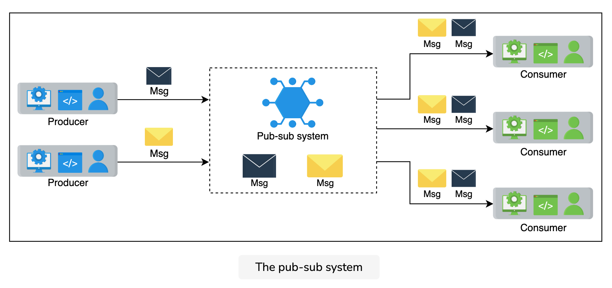
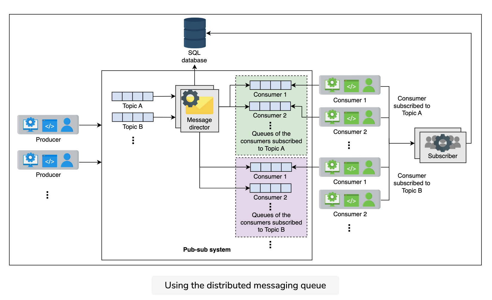
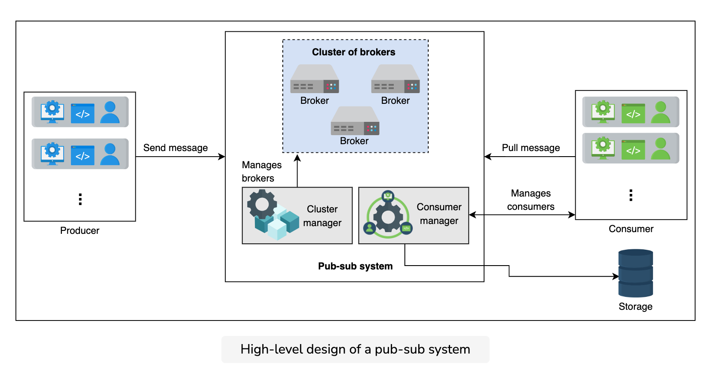
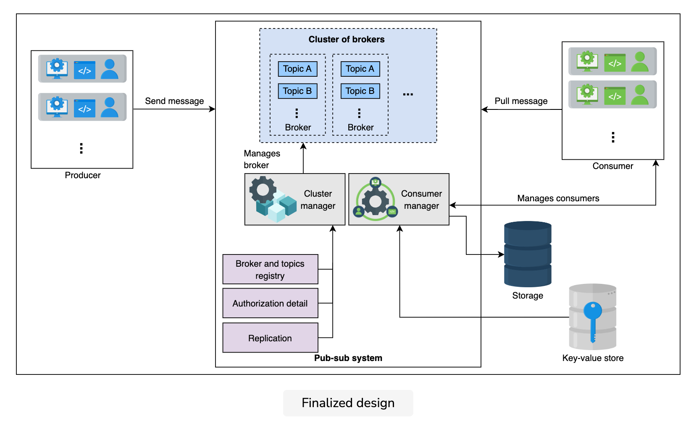

### Intro
Publish-subscribe messaging, often known as pub-sub messaging, is an asynchronous service-to-service communication method that’s popular in serverless and microservices architectures. Messages can be sent asynchronously to different subsystems of a system using the pub-sub system. All the services subscribed to the pub-sub model receive the message that’s pushed into the system.

For example, when Cristiano Ronaldo, a famous athlete, posts on Instagram or shares a tweet, all of his followers are updated. Here, Cristiano Ronaldo is the publisher, his post or tweet is the message, and all of his followers are subscribers.

A few use cases of pub-sub are listed below:

* Improved performance: The pub-sub system enables push-based distribution, alleviating the need for message recipients to check for new information and changes regularly. It encourages faster response times and lowers the delivery latency.

* Handling ingestion: The pub-sub helps in handling log ingestion. The user-interaction data can help us figure out useful analyses about the behavior of users. We can ingest a large amount of data to the pub-sub system, so much so that it can deliver the data to any analytical system to understand the behavior patterns of users. Moreover, we can also log the details of the event that’s happening while completing a request from the user. Large services like Meta use a pub-sub system called Scribe to know exactly who needs what data, and remove or archive processed or unwanted data. Doing this is necessary to manage an enormous amount of data.

* Real-time monitoring: Raw or processed messages of an application or system can be provided to multiple applications to monitor a system in real time.

* Replicating data: The pub-sub system can be used to distribute changes. For example, in a leader-follower protocol, the leader sends the changes to its followers via a pub-sub system. It allows followers to update their data asynchronously. The distributed caches can also refresh themselves by receiving the modifications asynchronously. Along the same lines, applications like WhatsApp that allow multiple views of the same conversation—for example, on a mobile phone and a computer’s browser—can elegantly work using a pub-sub, where multiple views can act either as a publisher or a subscriber.

### Difference with message queue?
The pub-sub system and queues are similar because they deliver information that’s produced by the producer to the consumer. **The difference is that only one consumer consumes a message in the queue, while there can be multiple consumers of the same message in a pub-sub system.**

### How are producers and consumers decoupled?
Producers don’t know who’ll end up reading their information. They just send it to the system, and it is read by the consumer. Producers are not affected by slow consumers, the count of consumers, or the failure of consumers. We can scale them independently.

### Requirements
**Functional**
* Create a topic: The producer should be able to create a topic.

* Write messages: Producers should be able to write messages to the topic.

* Subscription: Consumers should be able to subscribe to the topic to receive messages.

* Read messages: The consumer should be able to read messages from the topic.

* Specify retention time: The consumers should be able to specify the retention time after which the message should be deleted from the system.

* Delete messages: A message should be deleted from the topic or system after a certain retention period as defined by the user of the system.

**Non-functional**
* Scalable: The system should scale with an increasing number of topics and increasing writing (by producers) and reading (by consumers) load.

* Available: The system should be highly available, so that producers can add their data and consumers can read data from it anytime.

* Durability: The system should be durable. Messages accepted from producers must not be lost and should be delivered to the intended subscribers.

* Fault tolerance: Our system should be able to operate in the event of failures.

* Concurrent: The system should handle concurrency issues where reading and writing are performed simultaneously.

### API
**Create a topic**
The API call to create a topic should look like this:

`create(topic_ID, topic_name)`

This function returns an acknowledgment if it successfully creates a topic, or an error if it fails to do so.

**Write a message**

The API call to write into the pub-sub system should look like this:

`write(topic_ID, message)`

The API call will write a message into a topic with an ID of topic_ID. Each message can have a maximum size of 1 MB. This function will return an acknowledgment if it successfully places the data in the systems, or an appropriate error if it fails.

**Read a message**

The API call to read data from the system should look like this:

`read(topic_ID)`

The topic is found using topic_ID, and the call will return an object containing the message to the caller.

**Subscribe to a topic**

The API call to subscribe to a topic from the system should look like this:

`subscribe(topic_ID)`

The function adds the consumer as a subscriber to the topic that has the topic_ID.

**Unsubscribe from a topic**

The API call to unsubscribe from a topic from the system should look like this:

`unsubscribe(topic_ID)`

The function removes the consumer as a subscriber from the topic that has the topic_ID.

**Delete a topic**

The API call to delete a topic from the system should look like this:

`delete_topic(topic_ID)`

The function deletes the topic on the basis of the topic_ID.

### Building blocks
* Database: store information like the subscription details
* Distributed messaging queue: use a messaging queue to store messages sent by the producer
* Key-value: use a key-value store to hold information about consumers

### Initial design
The components we’ll need have been listed below:

* Topic queue: Each topic will be a distributed messaging queue so we can store the messages sent to us from the producer. A producer will write their messages to that queue.

* Database: We’ll use a relational database that will store the subscription details. For example, we need to store which consumer has subscribed to which topic so we can provide the consumers with their desired messages. We’ll use a relational database since our consumer-related data is structured and we want to ensure our data integrity.

* Message director: This service will read the message from the topic queue, fetch the consumers from the database, and send the message to the consumer queue.

* Consumer queue: The message from the topic queue will be copied to the consumer’s queue so the consumer can read the message. For each consumer, we’ll define a separate distributed queue.

* Subscriber: When the consumer requests a subscription to a topic, this service will add an entry into the database.

Using the distributed messaging queues makes our design simple. However, the huge number of queues needed is a significant concern. If we have millions of subscribers for thousands of topics, defining and maintaining millions of queues is expensive. Moreover, we’ll copy the same message for a topic in all subscriber queues, which is unnecessary duplication and takes up space.

#### Questions
Is there a way to avoid maintaining a separate queue for each reader?

In messaging queues, the message disappears after the reader consumes it. So, what if we add a counter for each message? The counter value decrements as a subscriber consumes the message. It does not delete the message until the counter becomes zero. Now, we don’t need to keep a separate queue for each reader.

### Second design
* Broker: This server will handle the messages. It will store the messages sent from the producer and allow the consumers to read them.
* Cluster manager: We’ll have numerous broker servers to cater to our scalability needs. We need a cluster manager to supervise the broker’s health. It will notify us if a broker fails.
* Storage: We’ll use a relational database to store consumer details, such as subscription information and retention period.
* Consumer manager: This is responsible for managing the consumers. For example, it will verify if the consumer is authorized to read a message from a certain topic or not.

**Additional components**
* Acknowledgment: An acknowledgment is used to notify the producer that the received message has been stored successfully. The system will wait for an acknowledgment from the consumer if it has successfully consumed the message.

* Retention time: The consumers can specify the retention period time of their messages. The default will be seven days, but it is configurable. Some applications like banking applications require the data to be stored for a few weeks as a business requirement, while an analytical application might not need the data after consumption.

#### Broker
The broker server is the core component of our pub-sub system. It will handle write and read requests. A broker will have multiple topics where each topic can have multiple partitions associated with it. We use partitions to store messages in the local storage for persistence. Consequently, this improves availability. Partitions contain messages encapsulated in segments. Segments help identify the start and end of a message using an offset address. Using segments, consumers consume the message of their choice from a partition by reading from a specific offset address. The illustration below depicts the concept that has been described above.

As we know, a topic is a persistent sequence of messages stored in the local storage of the broker. Once the data has been added to the topic, it cannot be modified. Reading and writing a message from or to a topic is an I/O task for computers, and scaling such tasks is challenging. This is the reason we split the topics into multiple partitions. The data belonging to a single topic can be present in numerous partitions. For example, let’s assume have Topic A and we allocate three partitions for it. The producers will send their messages to the relevant topic. The messages received will be sent to various partitions on basis of the round-robin algorithm. We’ll use a variation of round-robin: weighted round-robin. The following slides show how the messages are stored in various partitions belonging to a single topic.

We’ll allocate the partitions to various brokers in the system. This just means that different partitions of the same topic will be in different brokers. We’ll follow strict ordering in partitions by adding newer content at the end of existing messages.

Consider the slides below. We have various brokers in our system. Each broker has different topics. The topic is divided into multiple partitions.

We discussed that a message will be stored in a segment. We’ll identify each segment using an offset. Since these are immutable records, the readers are independent and they can read messages anywhere from this file using the necessary API functions. The following slides show the segment level detail.

##### Questions
If we use a round-robin algorithm to send messages to a partition, how does the system know where to look when it is time to read?

Our system will need to keep appropriate metadata persistently. This metadata will keep mappings between the logical index of segment or messages to the server identity or partition identifier.

#### Cluster manager
We’ll have multiple brokers in our cluster. The cluster manager will perform the following tasks:

* Broker and topics registry: This stores the list of topics for each broker.

* Manage replication: The cluster manager manages replication by using the leader-follower approach. One of the brokers is the leader. If it fails, the manager decides who the next leader is. In case the follower fails, it adds a new broker and makes sure to turn it into an updated follower. It updates the metadata accordingly. We’ll keep three replicas of each partition on different brokers.

#### Consumer manager
The consumer manager will manage the consumers. It has the following responsibilities:

( Verify the consumer: The manager will fetch the data from the database and verify if the consumer is allowed to read a certain message. For example, if the consumer has subscribed to Topic A (but not to Topic B), then it should not be allowed to read from Topic B. The consumer manager verifies the consumer’s request.

* Retention time management: The manager will also verify if the consumer is allowed to read the specific message or not. If, according to its retention time, the message should be inaccessible to the consumer, then it will not allow the consumer to read the message.

* Message receiving options management: There are two methods for consumers to get data. The first is that our system pushes the data to its consumers. This method may result in overloading the consumers with continuous messages. Another approach is for consumers to request the system to read data from a specific topic. The drawback is that a few consumers might want to know about a message as soon as it is published, but we do not support this function.

Therefore, we’ll support both techniques. Each consumer will inform the broker that it wants the data to be pushed automatically or it needs the data to read itself. We can avoid overloading the consumer and also provide liberty to the consumer. We’ll save this information in the relational database along with other consumer details.

* Allow multiple reads: The consumer manager stores the offset information of each consumer. We’ll use a key-value to store offset information against each consumer. It allows fast fetching and increases the availability of the consumers. If Consumer 1 has read from offset 0 and has sent the acknowledgment, we’ll store it. So, when the consumer wants to read again, we can provide the next offset to the reader for reading the message.

### Conclusion
We saw two designs of pub-sub, using queues and using our custom storage optimized for writing and reading small-sized data.

There are numerous use cases of a pub-sub. Due to decoupling between producers and consumers, the system can scale dynamically, and the failures are well-contained. Additionally, due to proper accounting of data consumption, the pub-sub is a system of choice for a large-scale system that produces enormous data. We can determine precisely which data is needed and not needed.
