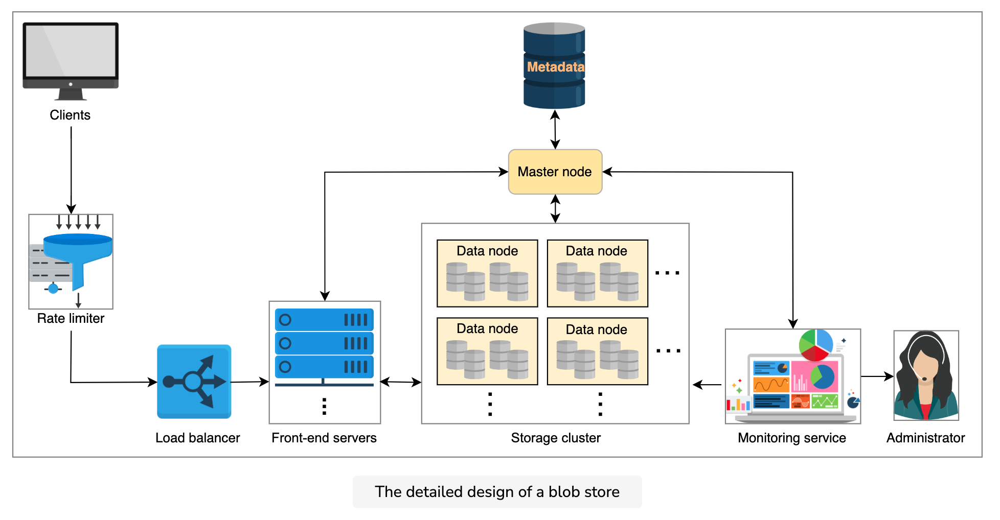

### Intro
Blob store is a storage solution for unstructured data. We can store photos, audio, videos, binary executable codes, or other multimedia items in a blob store. Every type of data is stored as a blob. It follows a flat data organization pattern where there are no hierarchies, that is, directories, sub-directories, and so on.

Blob = A blob (binary large object) consists of a collection of binary data stored as a single unit.

Mostly, it’s used by applications with a particular business requirement called write once, read many (WORM), which states that data can only be written once and that no one can change it. Just like in Microsoft Azure, the blobs are created once and read many times. Additionally, these blobs can’t be deleted until a specified interval, and they also can’t be modified to protect critical data.

Note: It isn’t necessary for all applications to have this WORM requirement. However, we are assuming that the blobs that are written can’t be modified. Instead of modifying, we can upload a new version of a blob if needed.

Blob store is an important component of many data-intensive applications, such as YouTube, Netflix, Facebook, and so on. The table below displays the blob storage used by some of the most well-known applications. These applications generate a huge amount of unstructured data every day. They require a storage solution that is easily scalable, reliable, and highly available, so that they can store large media files. Since the amount of data continuously increases, these applications need to store an unlimited number of blobs. According to some estimates, YouTube requires more than a petabyte of additional storage per day. In a system like YouTube, a video is stored in multiple resolutions. Additionally, the video in all resolutions is replicated many times across different data centers and regions for availability purposes. That’s why the total storage required per video is not equal to the size of the uploaded video.

**System / Blob Store**

Netflix / S3

YouTube / Google Cloud Storage

Facebook / Tectonic

### Requirements
* Put data: The blob store should allow users to upload blobs to the created containers.
* Get data: The system should generate a URL for the uploaded blob, so that the user can access that blob later through this URL.
* Delete data: The users should be able to delete a blob. If the user wants to keep the data for a specified period of time (retention time), our system should support this functionality.
* List blobs: The user should be able to get a list of blobs inside a specific container.
* Delete a container: The users should be able to delete a container and all the blobs inside it.
* List containers: The system should allow the users to list all the containers under a specific account.

