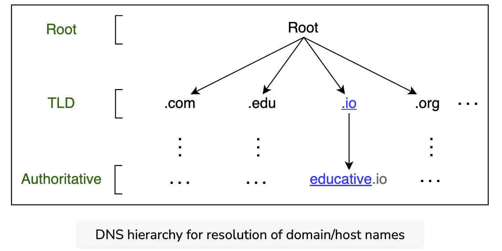
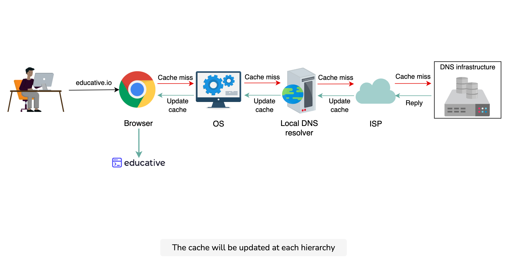

### Notes
The domain name system (DNS) is the Internet’s naming service that maps human-friendly domain names to machine-readable IP addresses. The service of DNS is transparent to users. When a user enters a domain name in the browser, the browser has to translate the domain name to IP address by asking the DNS infrastructure. Once the desired IP address is obtained, the user’s request is forwarded to the destination web server.

Let’s highlight some of the important details about DNS, some of which we’ll cover in the next lesson:

* Name servers: It’s important to understand that the DNS isn’t a single server. It’s a complete infrastructure with numerous servers. DNS servers that respond to users’ queries are called name servers.

* Resource records: The DNS database stores domain name to IP address mappings in the form of resource records (RR). The RR is the smallest unit of information that users request from the name servers. There are different types of RRs. The table below describes common RRs. The three important pieces of information are type, name, and value. The name and value change depending upon the type of the RR.

* Caching: DNS uses caching at different layers to reduce request latency for the user. Caching plays an important role in reducing the burden on DNS infrastructure because it has to cater to the queries of the entire Internet.

* Hierarchy: DNS name servers are in a hierarchical form. The hierarchical structure allows DNS to be highly scalable because of its increasing size and query load. In the next lesson, we’ll look at how a tree-like structure is used to manage the entire DNS database.

#### DNS Hierarchy
As stated before, the DNS isn’t a single server that accepts requests and responds to user queries. It’s a complete infrastructure with name servers at different hierarchies.

There are mainly four types of servers in the DNS hierarchy:

* DNS resolver: Resolvers initiate the querying sequence and forward requests to the other DNS name servers. Typically, DNS resolvers lie within the premise of the user’s network. However, DNS resolvers can also cater to users’ DNS queries through caching techniques, as we will see shortly. These servers can also be called local or default servers.

* Root-level name servers: These servers receive requests from local servers. Root name servers maintain name servers based on top-level domain names, such as .com, .edu, .us, and so on. For instance, when a user requests the IP address of educative.io, root-level name servers will return a list of top-level domain (TLD) servers that hold the IP addresses of the .io domain.

* Top-level domain (TLD) name servers: These servers hold the IP addresses of authoritative name servers. The querying party will get a list of IP addresses that belong to the authoritative servers of the organization.

* Authoritative name servers: These are the organization’s DNS name servers that provide the IP addresses of the web or application servers.

#### Caching
Caching refers to the temporary storage of frequently requested resource records. A record is a data unit within the DNS database that shows a name-to-value binding. Caching reduces response time to the user and decreases network traffic. When we use caching at different hierarchies, it can reduce a lot of querying burden on the DNS infrastructure. Caching can be implemented in the browser, operating systems, local name server within the user’s network, or the ISP’s DNS resolvers.

#### Distributed system
Although the DNS hierarchy facilitates the distributed Internet that we know today, it’s a distributed system itself. The distributed nature of DNS has the following advantages:

* It avoids becoming a single point of failure (SPOF).
* It achieves low query latency so users can get responses from nearby servers.
* It gets a higher degree of flexibility during maintenance and updates or upgrades. For example, if one DNS server is down or overburdened, another DNS server can respond to user queries.

