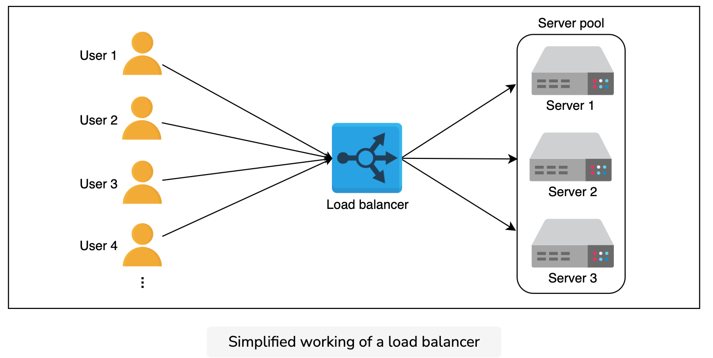
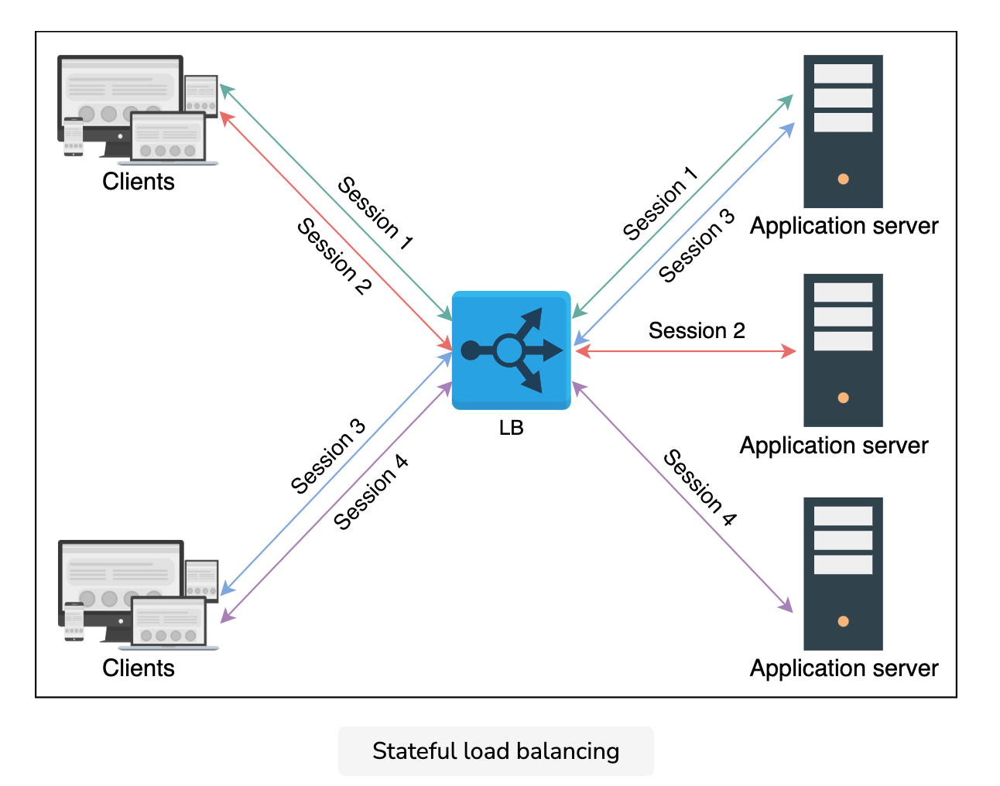
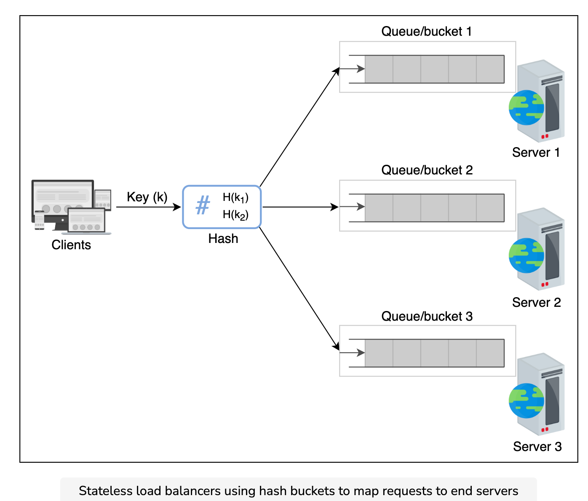

### Notes
Millions of requests could arrive per second in a typical data center. To serve these requests, thousands (or a hundred thousand) servers work together to share the load of incoming requests.

Note: Here, it’s important that we consider how the incoming requests will be divided among all the available servers.

A load balancer (LB) is the answer to the question. The job of the load balancer is to fairly divide all clients’ requests among the pool of available servers. Load balancers perform this job to avoid overloading or crashing servers.

The load balancing layer is the first point of contact within a data center after the firewall. A load balancer may not be required if a service entertains a few hundred or even a few thousand requests per second. However, for increasing client requests, load balancers provide the following capabilities:

* Scalability: By adding servers, the capacity of the application/service can be increased seamlessly. Load balancers make such upscaling or downscaling transparent to the end users.
* Availability: Even if some servers go down or suffer a fault, the system still remains available. One of the jobs of the load balancers is to hide faults and failures of servers.
* Performance: Load balancers can forward requests to servers with a lesser load so the user can get a quicker response time. This not only improves performance but also improves resource utilization.

#### Placing LBs
Generally, LBs sit between clients and servers. Requests go through to servers and back to clients via the load balancing layer. However, that isn’t the only point where load balancers are used.

Let’s consider the three well-known groups of servers. That is the web, the application, and the database servers. To divide the traffic load among the available servers, load balancers can be used between the server instances of these three services in the following way:

* Place LBs between end users of the application and web servers/application gateway.
* Place LBs between the web servers and application servers that run the business/application logic.
* Place LBs between the application servers and database servers.

#### Services
LBs not only enable services to be scalable, available, and highly performant, they offer some key services like the following:

* Health checking: LBs use the heartbeat protocol to monitor the health and, therefore, reliability of end-servers. Another advantage of health checking is the improved user experience.
* TLS termination: LBs reduce the burden on end-servers by handling TLS termination with the client.
* Predictive analytics: LBs can predict traffic patterns through analytics performed over traffic passing through them or using statistics of traffic obtained over time.
* Reduced human intervention: Because of LB automation, reduced system administration efforts are required in handling failures.
* Service discovery: An advantage of LBs is that the clients’ requests are forwarded to appropriate hosting servers by inquiring about the service registry.
* Security: LBs may also improve security by mitigating attacks like denial-of-service (DoS) at different layers of the OSI model (layers 3, 4, and 7).

#### Global vs. Local
From the previous lesson, it may seem like load balancing is performed only within the data center. However, load balancing is required at a global and a local scale. Let’s understand the function of each of the two:

* Global server load balancing (GSLB): GSLB involves the distribution of traffic load across multiple geographical regions.
* Local load balancing: This refers to load balancing achieved within a data center. This type of load balancing focuses on improving efficiency and better resource utilization of the hosting servers in a data center.

#### Global
GSLB ensures that globally arriving traffic load is intelligently forwarded to a data center. For example, power or network failure in a data center requires that all the traffic be rerouted to another data center. GSLB takes forwarding decisions based on the users’ geographic locations, the number of hosting servers in different locations, the health of data centers, and so on.

In the next lesson, we’ll also learn how GSLB offers automatic zonal failover. GSLB service can be installed on-premises or obtained through Load Balancing as a Service (LBaaS).

The illustration below shows that the GSLB can forward requests to three different data centers. Each local load balancing layer within a data center will maintain a control plane connection with the GSLB providing information about the health of the LBs and the server farm. GSLB uses this information to drive traffic decisions and forward traffic load based on each region’s configuration and monitoring information.

#### Local load balancing
Local load balancers reside within a data center. They behave like a reverse proxy and make their best effort to divide incoming requests among the pool of available servers. Incoming clients’ requests seamlessly connect to the LB that uses a virtual IP address

#### Algorithms
Load balancers distribute client requests according to an algorithm. Some well-known algorithms are given below:

* Round-robin scheduling: In this algorithm, each request is forwarded to a server in the pool in a repeating sequential manner.
* Weighted round-robin: If some servers have a higher capability of serving clients’ requests, then it’s preferred to use a weighted round-robin algorithm. In a weighted round-robin algorithm, each node is assigned a weight. LBs forward clients’ requests according to the weight of the node. The higher the weight, the higher the number of assignments.
* Least connections: In certain cases, even if all the servers have the same capacity to serve clients, uneven load on certain servers is still a possibility. For example, some clients may have a request that requires longer to serve. Or some clients may have subsequent requests on the same connection. In that case, we can use algorithms like least connections where newer arriving requests are assigned to servers with fewer existing connections. LBs keep a state of the number and mapping of existing connections in such a scenario. We’ll discuss more about state maintenance later in the lesson.
* Least response time: In performance-sensitive services, algorithms such as least response time are required. This algorithm ensures that the server with the least response time is requested to serve the clients.
* IP hash: Some applications provide a different level of service to users based on their IP addresses. In that case, hashing the IP address is performed to assign users’ requests to servers.
* URL hash: It may be possible that some services within the application are provided by specific servers only. In that case, a client requesting service from a URL is assigned to a certain cluster or set of servers. The URL hashing algorithm is used in those scenarios.

#### Stateful
As the name indicates, stateful load balancing involves maintaining a state of the sessions established between clients and hosting servers. The stateful LB incorporates state information in its algorithm to perform load balancing.

Essentially, the stateful LBs retain a data structure that maps incoming clients to hosting servers. Stateful LBs increase complexity and limit scalability because session information of all the clients is maintained across all the load balancers. That is, load balancers share their state information with each other to make forwarding decisions.

#### Stateless
Stateless load balancing maintains no state and is, therefore, faster and lightweight. Stateless LBs use consistent hashing to make forwarding decisions. However, if infrastructure changes (for example, a new application server joining), stateless LBs may not be as resilient as stateful LBs because consistent hashing alone isn’t enough to route a request to the correct application server. Therefore, a local state may still be required along with consistent hashing.

