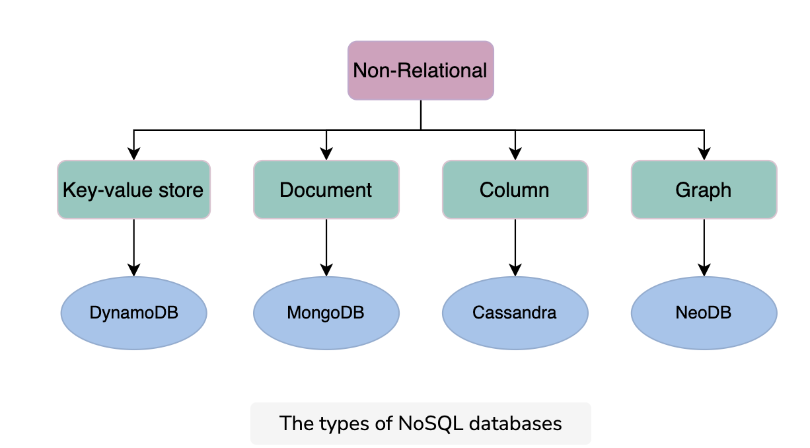

### NOTES
The above limitations can be addressed using databases.

A database is an organized collection of data that can be managed and accessed easily. Databases are created to make it easier to store, retrieve, modify, and delete data in connection with different data-processing procedures.

Some of the applications where we use database management are the banking systems, online shopping stores, and so on. Different organizations have different sizes of databases according to their needs.

Note: According to a source, the World Data Center for Climate (WDCC) is the largest database in the world. It contains around 220 terabytes of web data and 6 petabytes of additional data.

There are two basic types of databases:

1. SQL (relational databases)
2. NoSQL (non-relational databases)

They differ in terms of their intended use case, the type of information they hold, and the storage method they employ.

#### SQL versus. NoSQL
Relational databases, like phone books that record contact numbers and addresses, are organized and have predetermined schemas. Non-relational databases, like file directories that store anything from a person’s constant information to shopping preferences, are unstructured, scattered, and feature a dynamic schema. We’ll discuss their differences and their types in detail in the next lesson.

#### Advantages
Managing large data: A large amount of data can be easily handled with a database, which wouldn’t be possible using other tools.

* Retrieving accurate data (data consistency): Due to different constraints in databases, we can retrieve accurate data whenever we want.
* Easy updation: It is quite easy to update data in databases using data manipulation language (DML).
* Security: Databases ensure the security of the data. A database only allows authorized users to access data.
* Data integrity: Databases ensure data integrity by using different constraints for data.
* Availability: Databases can be replicated (using data replication) on different servers, which can be concurrently updated. These replicas ensure availability.
* Scalability: Databases are divided (using data partitioning) to manage the load on a single node. This increases scalability.

#### Relational databases
Relational databases adhere to particular schemas before storing the data. The data stored in relational databases has prior structure. Mostly, this model organizes data into one or more relations (also called tables), with a unique key for each tuple (instance). Each entity of the data consists of instances and attributes, where instances are stored in rows, and the attributes of each instance are stored in columns. Since each tuple has a unique key, a tuple in one table can be linked to a tuple in other tables by storing the primary keys in other tables, generally known as foreign keys.

A Structure Query Language (SQL) is used for manipulating the database. This includes insertion, deletion, and retrieval of data.

There are various reasons for the popularity and dominance of relational databases, which include simplicity, robustness, flexibility, performance, scalability, and compatibility in managing generic data.

Relational databases provide the atomicity, consistency, isolation, and durability (ACID) properties to maintain the integrity of the database. ACID is a powerful abstraction that simplifies complex interactions with the data and hides many anomalies (like dirty reads, dirty writes, read skew, lost updates, write skew, and phantom reads) behind a simple transaction abort.

But ACID is like a big hammer by design so that it’s generic enough for all the problems. If some specific application only needs to deal with a few anomalies, there’s a window of opportunity to use a custom solution for higher performance, though there is added complexity.

Let’s discuss ACID in detail:

* Atomicity: A transaction is considered an atomic unit. Therefore, either all the statements within a transaction will successfully execute, or none of them will execute. If a statement fails within a transaction, it should be aborted and rolled back.

* Consistency: At any given time, the database should be in a consistent state, and it should remain in a consistent state after every transaction. For example, if multiple users want to view a record from the database, it should return a similar result each time.

* Isolation: In the case of multiple transactions running concurrently, they shouldn’t be affected by each other. The final state of the database should be the same as the transactions were executed sequentially.

* Durability: The system should guarantee that completed transactions will survive permanently in the database even in system failure events.

Various database management systems (DBMS) are used to define relational database schema along with other operations, such as to store, retrieve, and run SQL queries on data. Some of the popular DBMS are as follows:

* MySQL
* Oracle Database
* Microsoft SQL Server
* IBM DB2
* Postgres
* SQLite

#### Why NoSQL?
A NoSQL database is designed for a variety of data models to access and manage data. There are various types of NoSQL databases, which we’ll explain in the next section. These databases are used in applications that require a large volume of semi-structured and unstructured data, low latency, and flexible data models. This can be achieved by relaxing some of the data consistency restrictions of other databases. Following are some characteristics of the NoSQL database:

* Simple design: Unlike relational databases, NoSQL doesn’t require dealing with the impedance mismatch—for example, storing all the employees’ data in one document instead of multiple tables that require join operations. This strategy makes it simple and easier to write less code, debug, and maintain.

* Horizontal scaling: Primarily, NoSQL is preferred due to its ability to run databases on a large cluster. This solves the problem when the number of concurrent users increases. NoSQL makes it easier to scale out since the data related to a specific employee is stored in one document instead of multiple tables over nodes. NoSQL databases often spread data across multiple nodes and balance data and queries across nodes automatically. In case of a node failure, it can be transparently replaced without any application disruption.

* Availability: To enhance the availability of data, node replacement can be performed without application downtime. Most of the non-relational databases’ variants support data replication to ensure high availability and disaster recovery.

* Support for unstructured and semi-structured data: Many NoSQL databases work with data that doesn’t have schema at the time of database configuration or data writes. For example, document databases are structureless; they allow documents (JSON, XML, BSON, and so on) to have different fields. For example, one JSON document can have fewer fields than the other.

* Cost: Licenses for many RDBMSs are pretty expensive, while many NoSQL databases are open source and freely available. Similarly, some RDBMSs rely on costly proprietary hardware and storage systems, while NoSQL databases usually use clusters of cheap commodity servers.

##### Key-value DB
Key-value databases use key-value methods like hash tables to store data in key-value pairs. We can see this depicted in the figure a couple of paragraphs below. Here, the key serves as a unique or primary key, and the values can be anything ranging from simple scalar values to complex objects. These databases allow easy partitioning and horizontal scaling of the data. Some popular key-value databases include Amazon DynamoDB, Redis, and Memcached DB.

Use case: Key-value databases are efficient for session-oriented applications. Session oriented-applications, such as web applications, store users’ data in the main memory or in a database during a session. This data may include user profile information, recommendations, targeted promotions, discounts, and more. A unique ID (a key) is assigned to each user’s session for easy access and storage. Therefore, a better choice to store such data is the key-value database.

The following figure shows an example of a key-value database. The Product ID and Type of the item are collectively considered as the primary key. This is considered as a key for this key-value database. Moreover, the schema for storing the item attributes is defined based on the nature of the item and the number of attributes it possesses.

##### Document DB
A document database is designed to store and retrieve documents in formats like XML, JSON, BSON, and so on. These documents are composed of a hierarchical tree data structure that can include maps, collections, and scalar values. Documents in this type of database may have varying structures and data. MongoDB and Google Cloud Firestore are examples of document databases.

Use case: Document databases are suitable for unstructured catalog data, like JSON files or other complex structured hierarchical data. For example, in e-commerce applications, a product has thousands of attributes, which is unfeasible to store in a relational database due to its impact on the reading performance. Here comes the role of a document database, which can efficiently store each attribute in a single file for easy management and faster reading speed. Moreover, it’s also a good option for content management applications, such as blogs and video platforms. An entity required for the application is stored as a single document in such applications.

##### Graph DB
Graph databases use the graph data structure to store data, where nodes represent entities, and edges show relationships between entities. The organization of nodes based on relationships leads to interesting patterns between the nodes. This database allows us to store the data once and then interpret it differently based on relationships. Popular graph databases include Neo4J, OrientDB, and InfiniteGraph. Graph data is kept in store files for persistent storage. Each of the files contains data for a specific part of the graph, such as nodes, links, properties, and so on.

In the following figure, some data is stored using a graph data structure in nodes connected to each other via edges representing relationships between nodes. Each node has some properties, like Name, ID, and Age. The node having ID: 2 has the Name of James and Age of 29 years.

##### Columnar DB
Columnar databases store data in columns instead of rows. They enable access to all entries in the database column quickly and efficiently. Popular columnar databases include Cassandra, HBase, Hypertable, and Amazon SimpleDB.

Use case: Columnar databases are efficient for a large number of aggregation and data analytics queries. It drastically reduces the disk I/O requirements and the amount of data required to load from the disk. For example, in applications related to financial institutions, there’s a need to sum the financial transaction over a period of time. Columnar databases make this operation quicker by just reading the column for the amount of money, ignoring other attributes of customers.

The following figure shows an example of a columnar database, where data is stored in a column-oriented format. This is unlike relational databases, which store data in a row-oriented fashion:

#### Replication
Replication refers to keeping multiple copies of the data at various nodes (preferably geographically distributed) to achieve availability, scalability, and performance. In this lesson, we assume that a single node is enough to hold our entire data. We won’t use this assumption while discussing the partitioning of data in multiple nodes. Often, the concepts of replication and partitioning go together.

However, with many benefits, like availability, replication comes with its complexities. Replication is relatively simple if the replicated data doesn’t require frequent changes. The main problem in replication arises when we have to maintain changes in the replicated data over time.

##### Synchronous vs. Asynchronous
In synchronous replication, the primary node waits for acknowledgments from secondary nodes about updating the data. After receiving acknowledgment from all secondary nodes, the primary node reports success to the client. Whereas in asynchronous replication, the primary node doesn’t wait for the acknowledgment from the secondary nodes and reports success to the client after updating itself.

The advantage of synchronous replication is that all the secondary nodes are completely up to date with the primary node. However, there’s a disadvantage to this approach. If one of the secondary nodes doesn’t acknowledge due to failure or fault in the network, the primary node would be unable to acknowledge the client until it receives the successful acknowledgment from the crashed node. This causes high latency in the response from the primary node to the client.

On the other hand, the advantage of asynchronous replication is that the primary node can continue its work even if all the secondary nodes are dow

##### Replication models
Now, let’s discuss various mechanisms of data replication. In this section, we’ll discuss the following models along with their strengths and weaknesses:

* Single leader or primary-secondary replication
* Multi-leader replication
* Peer-to-peer or leaderless replication

##### Single leader/primary-secondary replication
In primary-secondary replication, data is replicated across multiple nodes. One node is designated as the primary. It’s responsible for processing any writes to data stored on the cluster. It also sends all the writes to the secondary nodes and keeps them in sync.

Primary-secondary replication is appropriate when our workload is read-heavy. To better scale with increasing readers, we can add more followers and distribute the read load across the available followers. However, replicating data to many followers can make a primary bottleneck. Additionally, primary-secondary replication is inappropriate if our workload is write-heavy.

Another advantage of primary-secondary replication is that it’s read resilient. Secondary nodes can still handle read requests in case of primary node failure. Therefore, it’s a helpful approach for read-intensive applications.

Replication via this approach comes with inconsistency if we use asynchronous replication. Clients reading from different replicas may see inconsistent data in the case of failure of the primary node that couldn’t propagate updated data to the secondary nodes. So, if the primary node fails, any missed updates not passed on to the secondary nodes can be lost.

###### Statement-based replication
In the statement-based replication approach, the primary node saves all statements that it executes, like insert, delete, update, and so on, and sends them to the secondary nodes to perform. This type of replication was used in MySQL before version 5.1.

This type of approach seems good, but it has its disadvantages. For example, any nondeterministic function (such as NOW()) might result in distinct writes on the follower and leader. Furthermore, if a write statement is dependent on a prior write, and both of them reach the follower in the wrong order, the outcome on the follower node will be uncertain.

###### Write-ahead log 
In the write-ahead log (WAL) shipping approach, the primary node saves the query before executing it in a log file known as a write-ahead log file. It then uses these logs to copy the data onto the secondary nodes. This is used in PostgreSQL and Oracle. The problem with WAL is that it only defines data at a very low level. It’s tightly coupled with the inner structure of the database engine, which makes upgrading software on the leader and followers complicated.

###### Logical log
In the logical (row-based) log replication approach, all secondary nodes replicate the actual data changes. For example, if a row is inserted or deleted in a table, the secondary nodes will replicate that change in that specific table. The binary log records change to database tables on the primary node at the record level. To create a replica of the primary node, the secondary node reads this data and changes its records accordingly. Row-based replication doesn’t have the same difficulties as WAL because it doesn’t require information about data layout inside the database engine.

##### Multi-leader
As discussed above, single leader replication using asynchronous replication has a drawback. There’s only one primary node, and all the writes have to go through it, which limits the performance. In case of failure of the primary node, the secondary nodes may not have the updated database.

Multi-leader replication is an alternative to single leader replication. There are multiple primary nodes that process the writes and send them to all other primary and secondary nodes to replicate. This type of replication is used in databases along with external tools like the Tungsten Replicator for MySQL.

This kind of replication is quite useful in applications in which we can continue work even if we’re offline—for example, a calendar application in which we can set our meetings even if we don’t have access to the internet. Once we’re online, it replicates its changes from our local database (our mobile phone or laptop acts as a primary node) to other nodes.

##### Conflicts

###### Conflict avoidance#
A simple strategy to deal with conflicts is to prevent them from happening in the first place. Conflicts can be avoided if the application can verify that all writes for a given record go via the same leader.

However, the conflict may still occur if a user moves to a different location and is now near a different data center. If that happens, we need to reroute the traffic. In such scenarios, the conflict avoidance approach fails and results in concurrent writes.

###### Last-write-wins
Using their local clock, all nodes assign a timestamp to each update. When a conflict occurs, the update with the latest timestamp is selected.

This approach can also create difficulty because the clock synchronization across nodes is challenging in distributed systems. There’s clock skew that can result in data loss.

##### Peerless 
In primary-secondary replication, the primary node is a bottleneck and a single point of failure. Moreover, it helps to achieve read scalability but fails in providing write scalability. The peer-to-peer replication model resolves these problems by not having a single primary node. All the nodes have equal weightage and can accept reads and writes requests. Amazon popularized such a scheme in their DynamoDB data store.

#### Partitioning
Data partitioning (or sharding) enables us to use multiple nodes where each node manages some part of the whole data. To handle increasing query rates and data amounts, we strive for balanced partitions and balanced read/write load.

##### Sharding
To divide load among multiple nodes, we need to partition the data by a phenomenon known as partitioning or sharding. In this approach, we split a large dataset into smaller chunks of data stored at different nodes on our network.

The partitioning must be balanced so that each partition receives about the same amount of data. If partitioning is unbalanced, the majority of queries will fall into a few partitions. Partitions that are heavily loaded will create a system bottleneck. The efficacy of partitioning will be harmed because a significant portion of data retrieval queries will be sent to the nodes that carry the highly congested partitions. Such partitions are known as hotspots. Generally, we use the following two ways to shard the data:

* Vertical sharding
* Horizontal sharding

###### Vertical
We can put different tables in various database instances, which might be running on a different physical server. We might break a table into multiple tables so that some columns are in one table while the rest are in the other. We should be careful if there are joins between multiple tables. We may like to keep such tables together on one shard.

Often, vertical sharding is used to increase the speed of data retrieval from a table consisting of columns with very wide text or a binary large object (blob). In this case, the column with large text or a blob is split into a different table.

###### Horizontal
At times, some tables in the databases become too big and affect read/write latency. Horizontal sharding or partitioning is used to divide a table into multiple tables by splitting data row-wise, as shown in the figure in the next section. Each partition of the original table distributed over database servers is called a shard. Usually, there are two strategies available:

**Key-range based sharding**
In the key-range based sharding, each partition is assigned a continuous range of keys.

**Hash based sharding**
Hash-based sharding uses a hash-like function on an attribute, and it produces different values based on which attribute the partitioning is performed. The main concept is to use a hash function on the key to get a hash value and then mod by the number of partitions. Once we’ve found an appropriate hash function for keys, we may give each partition a range of hashes (rather than a range of keys). Any key whose hash occurs inside that range will be kept in that partition.

**Consistent hashing**
Consistent hashing assigns each server or item in a distributed hash table a place on an abstract circle, called a ring, irrespective of the number of servers in the table. This permits servers and objects to scale without compromising the system’s overall performance.

**Fixed number of partitions**
In this approach, the number of partitions to be created is fixed at the time when we set our database up. We create a higher number of partitions than the nodes and assign these partitions to nodes. So, when a new node is added to the system, it can take a few partitions from the existing nodes until the partitions are equally divided.

There’s a downside to this approach. The size of each partition grows with the total amount of data in the cluster since all the partitions contain a small part of the total data. If a partition is very small, it will result in too much overhead because we may have to make a large number of small-sized partitions, each costing us some overhead. If the partition is very large, rebalancing the nodes and recovering from node failures will be expensive. It’s very important to choose the right number of partitions. A fixed number of partitions is used in Elasticsearch, Riak, and many more.

**Dynamic partition**
In this approach, when the size of a partition reaches the threshold, it’s split equally into two partitions. One of the two split partitions is assigned to one node and the other one to another node. In this way, the load is divided equally. The number of partitions adapts to the overall data amount, which is an advantage of dynamic partitioning.

However, there’s a downside to this approach. It’s difficult to apply dynamic rebalancing while serving the reads and writes. This approach is used in HBase and MongoDB.

##### Request routing
We’ve learned how to partition our data. However, one question arises here: How does a client know which node to connect to while making a request? The allocation of partitions to nodes varies after rebalancing. If we want to read a specific key, how do we know which IP address we need to connect to read?

This problem is also known as service discovery. Following are a few approaches to this problem:

Allow the clients to request any node in the network. If that node doesn’t contain the requested data, it forwards that request to the node that does contain the related data.

The second approach contains a routing tier. All the requests are first forwarded to the routing tier, and it determines which node to connect to fulfill the request.

The clients already have the information related to partitioning and which partition is connected to which node. So, they can directly contact the node that contains the data they need.

In all of these approaches, the main challenge is to determine how these components know about updates in the partitioning of the nodes.

###### Zookeeper
To track changes in the cluster, many distributed data systems need a separate management server like ZooKeeper. Zookeeper keeps track of all the mappings in the network, and each node connects to ZooKeeper for the information. Whenever there’s a change in the partitioning, or a node is added or removed, ZooKeeper gets updated and notifies the routing tier about the change. HBase, Kafka and SolrCloud use ZooKeeper.

#### Tradeoffs

##### Which is the best database sharding approach?#
Both horizontal and vertical sharding involve adding resources to our computing infrastructure. Our business stakeholders must decide which is suitable for our organization. We must scale our resources accordingly for our organization and business to grow, to prevent downtime, and to reduce latency. We can scale these resources through a combination of adjustments to CPU, physical memory requirements, hard disk adjustments, and network bandwidth.

The following sections explain the pros and cons of no sharding versus sharding.

###### Advantages and disadvantages of a centralized database
Advantages
* Data maintenance, such as updating and taking backups of a centralized database, is easy.

* Centralized databases provide stronger consistency and ACID transactions than distributed databases.

* Centralized databases provide a much simpler programming model for the end programmers as compared to distributed databases.

* It’s more efficient for businesses to have a small amount of data to store that can reside on a single node.

Disadvantages
* A centralized database can slow down, causing high latency for end users, when the number of queries per second accessing the centralized database is approaching single-node limits.

* A centralized database has a single point of failure. Because of this, its probability of not being accessible is much higher.

###### Advantages and disadvantages of a distributed database
Advantages
* It’s fast and easy to access data in a distributed database because data is retrieved from the nearest database shard or the one frequently used.

* Data with different levels of distribution transparency can be stored in separate places.

* Intensive transactions consisting of queries can be divided into multiple optimized subqueries, which can be processed in a parallel fashion.

Disadvantages
* Sometimes, data is required from multiple sites, which takes more time than expected.

* Relations are partitioned vertically or horizontally among different nodes. Therefore, operations such as joins need to reconstruct complete relations by carefully fetching data. These operations can become much more expensive and complex.

* It’s difficult to maintain consistency of data across sites in the distributed database, and it requires extra measures.

* Updations and backups in distributed databases take time to synchronize data.

##### Conclusion
Data distribution (vertical and horizontal sharding) across multiple nodes aims to improve the following features, considering that the queries are optimized:

* Reliability (fault-tolerance)
* Performance
* Balanced storage capacity and dollar costs