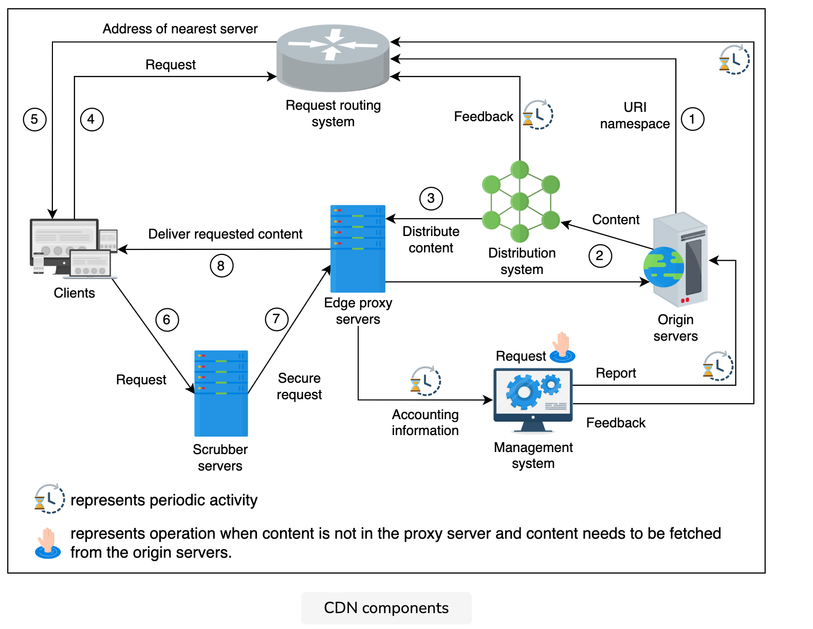

### Problem statement
Let’s start with a question: If millions of users worldwide use our data-intensive applications, and our service is deployed in a single data center to serve the users’ requests, what possible problems can arise?

The following problems can arise:

High latency: The user-perceived latency will be high due to the physical distance from the serving data center. User-perceived latency has many components, such as transmission delays (a function of available bandwidth), propagation delays (a function of distance), queuing delays (a function of network congestion), and nodal processing delays. Therefore, data transmission over a large distance results in higher latency. Real-time applications require a latency below 200 milliseconds (ms) in general. For the Voice over Internet Protocol (VoIP), latency should not be more than 150 ms, whereas video streaming applications cannot tolerate a latency above a few seconds.

* Data-intensive applications: Data-intensive applications require transferring large traffic. Over a longer distance, this could be a problem due to the network path stretching through different kinds of ISPs. Because of some smaller Path message transmission unit (MTU) links, the throughput of applications on the network might be reduced. Similarly, different portions of the network path might have different congestion characteristics. The problem multiplies as the number of users grows because the origin servers will have to provide the data individually to each user. That is, the primary data center will need to send out a lot of redundant data when multiple clients ask for it. However, applications that use streaming services are both data-intensive and dynamic in nature.

* Scarcity of data center resources: Important data center resources like computational capacity and bandwidth become a limitation when the number of users of a service increases significantly. Services engaging millions of users simultaneously need scaling. Even if scaling is achieved in a single data center, it can still suffer from becoming a single point of failure when the data center goes offline due to natural calamity or connectivity issues with the Internet.

### Solution
The solution to all the problems discussed in the previous lesson is the content delivery network (CDN). A CDN is a group of geographically distributed proxy servers. A proxy server is an intermediate server between a client and the origin server. The proxy servers are placed on the network edge. As the network edge is close to the end users, the placement of proxy servers helps quickly deliver the content to the end users by reducing latency and saving bandwidth. A CDN has added intelligence on top of being a simple proxy server.

We can bring data close to the user by placing a small data center near the user and storing copies of the data there. CDN mainly stores two types of data: static and dynamic. A CDN primarily targets propagation delay by bringing the data closer to its users. CDN providers make the extra effort to have sufficient bandwidth available through the path and bring data closer to the users (possibly within their ISP). They also try to reduce transmission and queuing delays because the ISP presumably has more bandwidth available within the autonomous system.

Let’s look at the different ways CDN solves the discussed problems:

* High latency: CDN brings the content closer to end users. Therefore, it reduces the physical distance and latency.

* Data-intensive applications: Since the path to the data includes only the ISP and the nearby CDN components, there’s no issue in serving a large number of users through a few CDN components in a specific area. As shown below, the origin data center will have to provide the data to local CDN components only once, whereas local CDN components can provide data to different users individually. No user will have to download their own copy of data from the origin servers.

### Requirements
**Functional requirements**
The following functional requirements will be a part of our design:

* Retrieve: Depending upon the type of CDN models, a CDN should be able to retrieve content from the origin servers. We’ll cover CDN models in the coming lesson.
* Request: Content delivery from the proxy server is made upon the user’s request. CDN proxy servers should be able to respond to each user’s request in this regard.
* Deliver: In the case of the push model, the origin servers should be able to send the content to the CDN proxy servers.
* Search: The CDN should be able to execute a search against a user query for cached or otherwise stored content within the CDN infrastructure.
* Update: In most cases, content comes from the origin server, but if we run script in CDN, the CDN should be able to update the content within peer CDN proxy servers in a PoP (points of presence).
* Delete: Depending upon the type of content (static or dynamic), it should be possible to delete cached entries from the CDN servers after a certain period.

**Non-functional requirements**

* Performance: Minimizing latency is one of the core missions of a CDN. The proposed design should have minimum possible latency.
* Availability: CDNs are expected to be available at all times because of their effectiveness. Availability includes protection against attacks like DDoS.
* Scalability: An increasing number of users will request content from CDNs. Our proposed CDN design should be able to scale horizontally as the requirements increase.
* Reliability and security: Our CDN design should ensure no single point of failure. Apart from failures, the designed CDN must reliably handle massive traffic loads. Furthermore, CDNs should provide protection to hosted content from various attacks

#### Building blocks
* DNS: maps human-friendly CDN domain names to machine-readable IP address.
* Load balancers: distribute requests to operational proxy servers

### Components
* Clients: End users use various clients, like browsers, smartphones, and other devices, to request content from the CDN.

* Routing system: The routing system directs clients to the nearest CDN facility. To do that effectively, this component receives input from various systems to understand where content is placed, how many requests are made for particular content, the load a particular set of servers is handling, and the URI (Uniform Resource Identifier) namespace of various contents. In the next lesson, we’ll discuss different routing mechanisms to forward users to the nearest CDN facility.

* Scrubber servers: Scrubber servers are used to separate the good traffic from malicious traffic and protect against well-known attacks, like DDoS. Scrubber servers are generally used only when an attack is detected. In that case, the traffic is scrubbed or cleaned and then routed to the target destination.

* Proxy servers: The proxy or edge proxy servers serve the content from RAM to the users. Proxy servers store hot data in RAM, though they can store cold data in SSD or hard drive as well. These servers also provide accounting information and receive content from the distribution system.

* Distribution system: The distribution system is responsible for distributing content to all the edge proxy servers to different CDN facilities. This system uses the Internet and intelligent broadcast-like approaches to distribute content across the active edge proxy servers.

* Origin servers: The CDN infrastructure facilitates users with data received from the origin servers. The origin servers serve any unavailable data at the CDN to clients. Origin servers will use appropriate stores to keep content and other mapping metadata. Though, we won’t discuss the internal architecture of origin infrastructure here.

* Management system: The management systems are important in CDNs from a business and managerial aspect where resource usage and statistics are constantly observed. This component measures important metrics, like latency, downtime, packet loss, server load, and so on. For third-party CDNs, accounting information can also be used for billing purposes.

1. The origin servers provide the URI namespace delegation of all objects cached in the CDN to the request routing system.

2. The origin server publishes the content to the distribution system responsible for data distribution across the active edge proxy servers.

3. The distribution system distributes the content among the proxy servers and provides feedback to the request routing system. This feedback is helpful in optimizing the selection of the nearest proxy server for a requesting client. This feedback contains information about which content is cached on which proxy server to route traffic to relevant proxy servers.

4. The client requests the routing system for a suitable proxy server from the request routing system.

5. The request routing system returns the IP address of an appropriate proxy server.

6. The client request routes through the scrubber servers for security reasons.

7. The scrubber server forwards good traffic to the edge proxy server.

8. The edge proxy server serves the client request and periodically forwards accounting information to the management system. The management system updates the origin servers and sends feedback to the routing system about the statistics and detail of the content. However, the request is routed to the origin servers if the content isn’t available in the proxy servers. It’s also possible to have a hierarchy of proxy servers if the content isn’t found in the edge proxy servers. For such cases, the request gets forwarded to the parent proxy servers.

#### APIs
* Retrieve content
If the proxy servers request content, the GET method retrieves the content through the /retrieveContent API below

`retrieveContent(proxyserver_id, content_type, content_version, description)`

* Deliver content
The origin servers use this API to deliver the specified content, theupdated version, to the proxy servers through the distribution system. We call this the /deliverContent API.

`deliverContent(origin_id, server_list, content_type, content_version, description)`

* Request content
The users use this API to request the content from the proxy servers. We call this the /requestContent API:

`requestContent(user_id, content_type, description)`

* Search content
Although the content is first searched locally at the proxy server, the proxy servers can also probe requested content in the peer proxy servers in the same PoP through the /searchContent API. This could flood the query to all proxy servers in a PoP. Alternatively, we can use a data store in the PoP to query the content, though proxy servers will need to maintain what content is available on which proxy server.

`searchContent(proxyserver_id, content_type, description)`

* Update content
The proxy servers use the /updateContent API to update the specified content in the peer proxy servers in the PoP. It does so when specified isolated scripts run on the CDN to provide image resizing, video resolution conversion, security, and many more services. This type of scripting is known as serverless scripting.

`updateContent(proxyserver_id, content_type, description)`

* Delete content

#### Content caching strategies

**Push CDN**
Content gets sent automatically to the CDN proxy servers from the origin server in the push CDN model. The content delivery to the CDN proxy servers is the content provider’s responsibility. Push CDN is appropriate for static content delivery, where the origin server decides which content to deliver to users using the CDN. The content is pushed to proxy servers in various locations according to the content’s popularity. If the content is rapidly changing, the push model might struggle to keep up and will do redundant content pushes.

**Pull CDN**
A CDN pulls the unavailable data from origin servers when requested by a user. The proxy servers keep the files for a specified amount of time and then remove them from the cache if they’re no longer requested to balance capacity and cost.

When users request web content in the pull CDN model, the CDN itself is responsible for pulling the requested content from the origin server and serving it to the users. Therefore, this type of CDN is more suited for serving dynamic content.

As stated, the push CDN is mostly used for serving static content. Since static content is served to a wide range of users for longer than dynamic content, the push CDN scheme maintains more replicas than the pull CDN, thus improving availability. On the other hand, the pull CDN is favored for frequently changing content and a high traffic load. Low storage consumption is one of the main benefits of the pull CDN.

#### DNS redirection
**HTTP redirection**
HTTP redirection is the simplest of all approaches. With this scheme, the client requests content from the origin server. The origin server responds with an HTTP protocol to redirect the user via a URL of the content.

Below is an example of an HTML snippet provided by Facebook. As is highlighted in line 8, the user is redirected to the CDN to download the logo of Facebook.

### Consistency
Data in the proxy servers should be consistent with data in the origin servers. There’s always a risk of users accessing stale data if the proxy servers don’t remain consistent with the origin servers. Different consistency mechanisms can be used to ensure consistency of data, depending on the push or pull model.

**Periodic polling**
Using the pull model, proxy servers request the origin server periodically for updated data and change the content in the cache accordingly. When content changes infrequently, the polling approach consumes unnecessary bandwidth. Periodic polling uses time-to-refresh (TTR) to adjust the time period for requesting updated data from the origin servers.

**Time-to-live**
Because of the TTR, the proxy servers may uselessly request the origin servers for updated data. A better approach that could be employed to reduce the frequency of refresh messages is the time-to-live (TTL) approach. In this approach, each object has a TTL attribute assigned to it by the origin server. The TTL defines the expiration time of the content. The proxy servers serve the same data version to the users until that content expires. Upon expiration, the proxy server checks for an update with the origin server. If the data is changed, it gets the updated data from the origin server and then responds to the user’s requests with the updated data. Otherwise, it keeps the same data with an updated expiration time from the origin servers.

#### CDN as a service
Most companies don’t build their own CDN. Instead, they use the services of a CDN provider, such as Akamai, Cloudflare, Fastly, and so on, to deliver their content. Similarly, players like AWS make it possible for anyone to use a global CDN facility.

The companies sign a contract with the CDN service provider and deliver their content to the CDN, thereby allowing the CDN to distribute the content to the end users. A public CDN raises the following concerns for content providers:

* The content provider can’t do anything if the public CDN is down.

* If a public CDN doesn’t have any proxy servers located in the region or country where some website traffic comes from, then those specific customers are out of luck. In such cases, the content providers have to buy CDN services from other CDN providers or deploy and use their own private CDN.

* It’s possible that some domains or IP addresses of CDN providers are blocked or restricted in some countries because they might be delivering content that’s banned in those countries.

### Evaluation

**Performance**
CDN achieves high performance by minimizing latency. Some of the key design decisions that minimize latency are as follows:

* Proxy servers usually serve content from the RAM.
* CDN proxy servers are placed near the users to provide faster access to content.
* A CDN can also be the provider of proxy servers located in the ISP or Internet exchange points (IXPs) to handle high traffic.
* The request routing system ensures that users are directed to the nearest proxy servers. We’ll have a detailed discussion on the request routing system in the next lesson.
* The proxy servers have long-tail content stored in nonvolatile storage systems like SSD or HDD. Serving from these resources results in a more negligible latency than we’d see from serving content from origin servers.
* As was discussed previously, proxy servers can be implemented in layers where if one layer doesn’t have the content, the request can be entertained by the next layer of proxy servers. For example, the edge proxy servers can request the parent proxy servers. Placing proxy servers at specific ISPs could be the best option when most traffic comes from those ISP regions

