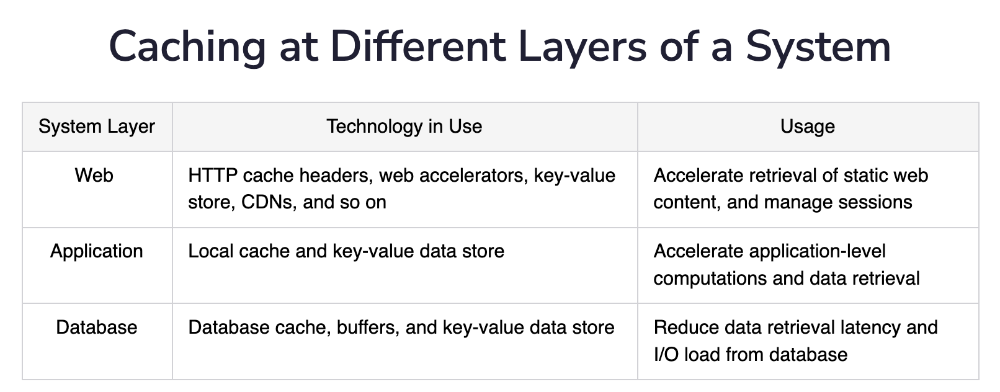
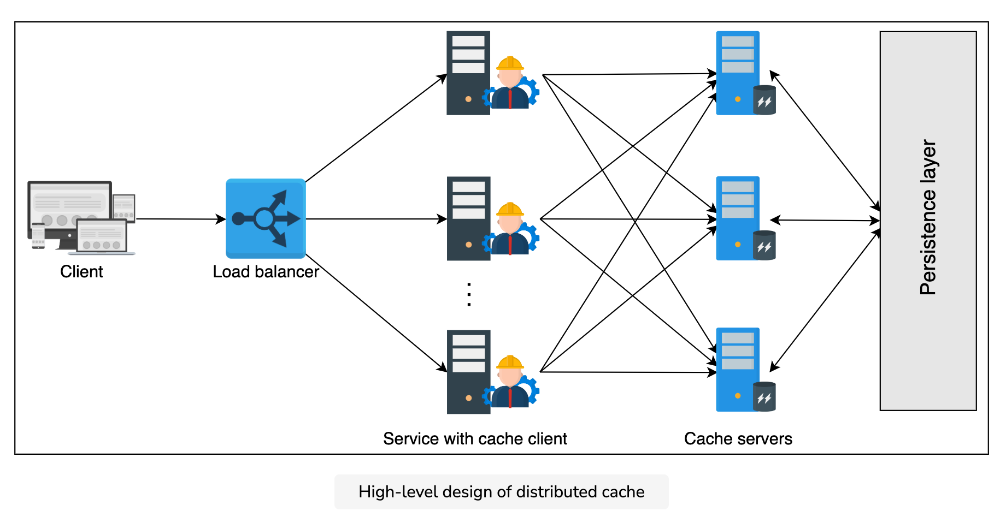
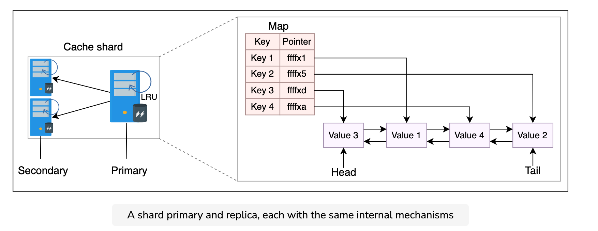
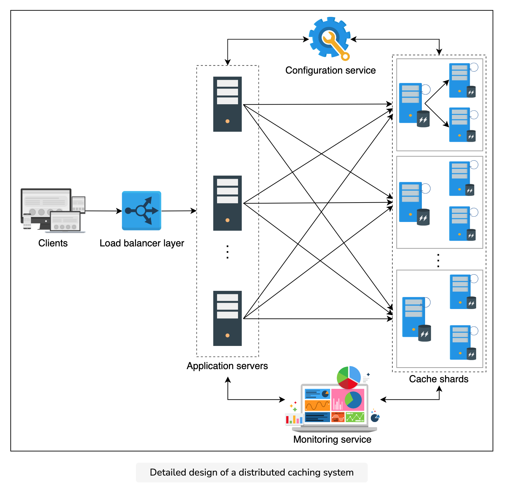

### Problem statement
A typical system consists of the following components:

It has a client that requests the service.
It has one or more service hosts that entertain client requests.
It has a database used by the service for data storage.
Under normal circumstances, this abstraction performs fine. However, as the number of users increases, the database queries also increase. And as a result, the service providers are overburdened, resulting in slow performance.

In such cases, a **cache** is added to the system to deal with performance deterioration. A cache is a temporary data storage that can serve data faster by keeping data entries in memory. Caches store only the most frequently accessed data. When a request reaches the serving host, it retrieves data from the cache (cache hit) and serves the user. However, if the data is unavailable in the cache (cache miss), the data will be queried from the database. Also, the cache is populated with the new value to avoid cache misses for the next time.

Cache hit = When the requested data is found in the cache, the server responds with the data immediately.

Cache miss = When the requested data isn’t found in the cache, it’s called a cache miss.

A cache is a nonpersistent storage area used to keep repeatedly read and written data, which provides the end user with lower latency. Therefore, a cache must serve data from a storage component that is fast, has enough storage, and is affordable in terms of dollar cost as we scale the caching service.

### Distributed cache
A distributed cache is a caching system where multiple cache servers coordinate to store frequently accessed data. Distributed caches are needed in environments where a single cache server isn’t enough to store all the data. At the same time, it’s scalable and guarantees a higher degree of availability.

Caches are generally small, frequently accessed, short-term storage with fast read time. Caches use the locality of reference principle.

Generally, distributed caches are beneficial in the following ways:

* They minimize user-perceived latency by precalculating results and storing frequently accessed data.
* They pre-generate expensive queries from the database.
* They store user session data temporarily.
* They serve data from temporary storage even if the data store is down temporarily.
* Finally, they reduce network costs by serving data from local resources.

#### Why?
When the size of data required in the cache increases, storing the entire data in one system is impractical. This is because of the following three reasons:

* It can be a potential single point of failure (SPOF).
* A system is designed in layers, and each layer should have its caching mechanism to ensure the decoupling of sensitive data from different layers.
* Caching at different locations helps reduce the serving latency at that layer.

### Writing policies
Often, cache stores a copy (or part) of data, which is persistently stored in a data store. When we store data to the data store, some important questions arise:

- Where do we store the data first? Database or cache?
- What will be the implication of each strategy for consistency models?

The short answer is, it depends on the application requirements. Let’s look at the details of different writing policies to understand the concept better:

* Write-through cache: The write-through mechanism writes on the cache as well as on the database. Writing on both storages can happen concurrently or one after the other. This increases the write latency but ensures strong consistency between the database and the cache.
* Write-back cache: In the write-back cache mechanism, the data is first written to the cache and asynchronously written to the database. Although the cache has updated data, inconsistency is inevitable in scenarios where a client reads stale data from the database. However, systems using this strategy will have small writing latency.
* Write-around cache: This strategy involves writing data to the database only. Later, when a read is triggered for the data, it’s written to cache after a cache miss. The database will have updated data, but such a strategy isn’t favorable for reading recently updated data.

### Eviction policies
One of the main reasons caches perform fast is that they’re small. Small caches mean limited storage capacity. Therefore, we need an eviction mechanism to remove less frequently accessed data from the cache.

Several well-known strategies are used to evict data from the cache. The most well-known strategies include the following:

* Least recently used (LRU)
* Most recently used (MRU)
* Least frequently used (LFU)
* Most frequently used (MFU)

Other strategies like first in, first out (FIFO) also exist. The choice of each of these algorithms depends on the system the cache is being developed for.

### Cache invalidation
Apart from the eviction of less frequently accessed data, some data residing in the cache may become stale or outdated over time. Such cache entries are invalid and must be marked for deletion.

The situation demands a question: How do we identify stale entries?

Resolution of the problem requires storing metadata corresponding to each cache entry. Specifically, maintaining a time-to-live (TTL) value to deal with outdated cache items.

We can use two different approaches to deal with outdated items using TTL:

* Active expiration: This method actively checks the TTL of cache entries through a daemon process or thread.
* Passive expiration: This method checks the TTL of a cache entry at the time of access.

Each expired item is removed from the cache upon discovery.

### Storage mechanism
Storing data in the cache isn’t as trivial as it seems because the distributed cache has multiple cache servers. When we use multiple cache servers, the following design questions need to be answered:

* Which data should we store in which cache servers?
* What data structure should we use to store the data?

The above two questions are important design issues because they’ll decide the performance of our distributed cache, which is the most important requirement for us. We’ll use the following techniques to answer the questions above.

### Hash function
It’s possible to use hashing in two different scenarios:

* Identify the cache server in a distributed cache to store and retrieve data.
* Locate cache entries inside each cache server.

For the first scenario, we can use different hashing algorithms. However, consistent hashing or its flavors usually perform well in distributed systems because simple hashing won’t be ideal in case of crashes or scaling.

In the second scenario, we can use typical hash functions to locate a cache entry to read or write inside a cache server. However, a hash function alone can only locate a cache entry. It doesn’t say anything about managing data within the cache server. That is, it doesn’t say anything about how to implement a strategy to evict less frequently accessed data from the cache server. It also doesn’t say anything about what data structures are used to store the data within the cache servers. This is exactly the second design question of the storage mechanism. Let’s take a look at the data structure next.

### Linked list
We’ll use a doubly linked list. The main reason is its widespread usage and simplicity. Furthermore, adding and removing data from the doubly linked list in our case will be a constant time operation. This is because we either evict a specific entry from the tail of the linked list or relocate an entry to the head of the doubly linked list. Therefore, no iterations are required.

### Sharding in cache clusters
To avoid SPOF and high load on a single cache instance, we introduce sharding. Sharding involves splitting up cache data among multiple cache servers. It can be performed in the following two ways.

**Dedicated cache servers**
In the dedicated cache servers method, we separate the application and web servers from the cache servers.

The advantages of using dedicated cache servers are the following:

* There’s flexibility in terms of hardware choices for each functionality.
* It’s possible to scale web/application servers and cache servers separately.

Apart from the advantages above, working as a standalone caching service enables other microservices to benefit from them—for example, Cache as a Service. In that case, the caching system will have to be aware of different applications so that their data doesn’t collide.

**Co-located cache**
The co-located cache embeds cache and service functionality within the same host.

The main advantage of this strategy is the reduction in CAPEX and OPEX of extra hardware. Furthermore, with the scaling of one service, automatic scaling of the other service is obtained. However, the failure of one machine will result in the loss of both services simultaneously.

### Cache client
We discussed that the hash functions should be used for the selection of cache servers. But what entity performs these hash calculations?

A cache client is a piece of code residing in hosting servers that do (hash) computations to store and retrieve data in the cache servers. Also, cache clients may coordinate with other system components like monitoring and configuration services. All cache clients are programmed in the same way so that the same PUT, and GET operations from different clients return the same results. Some of the characteristics of cache clients are the following:

* Each cache client will know about all the cache servers.
* All clients can use well-known transport protocols like TCP or UDP to talk to the cache servers.

### Design

#### Requirements
**Functional**
The following are the functional requirements:

* Insert data: The user of a distributed cache system must be able to insert an entry to the cache.
* Retrieve data: The user should be able to retrieve data corresponding to a specific key.

**Non-functional**
* High performance: The primary reason for the cache is to enable fast retrieval of data. Therefore, both the insert and retrieve operations must be fast.

* Scalability: The cache system should scale horizontally with no bottlenecks on an increasing number of requests.

* High availability: The unavailability of the cache will put an extra burden on the database servers, which can also go down at peak load intervals. We also require our system to survive occasional failures of components and network, as well as power outages.

* Consistency: Data stored on the cache servers should be consistent. For example, different cache clients retrieving the same data from different cache servers (primary or secondary) should be up to date.

* Affordability: Ideally, the caching system should be designed from commodity hardware instead of an expensive supporting component within the design of a system.

#### API
**Insertion** 
`insert(key, value)`

**Retrieval**
`retrieve(key)`

#### High-level

* Cache client: This library resides in the service application servers. It holds all the information regarding cache servers. The cache client will choose one of the cache servers using a hash and search algorithm for each incoming insert and retrieve request. All the cache clients should have a consistent view of all the cache servers. Also, the resolution technique to move data to and from the cache servers should be the same. Otherwise, different clients will request different servers for the same data.

* Cache servers: These servers maintain the cache of the data. Each cache server is accessible by all the cache clients. Each server is connected to the database to store or retrieve data. Cache clients use TCP or UDP protocol to perform data transfer to or from the cache servers. However, if any cache server is down, requests to those servers are resolved as a missed cache by the cache clients.

#### Detailed

##### Improve availability
The second problem relates to cache unavailability if the cache servers fail. A simple solution is the addition of replica nodes. We can start by adding one primary and two backup nodes in a cache shard. With replicas, there’s always a possibility of inconsistency. If our replicas are in close proximity, writing over replicas is performed synchronously to avoid inconsistencies between shard replicas. It’s crucial to divide cache data among shards so that neither the problem of unavailability arises nor any hardware is wasted.

This solution has two main advantages:

* There’s improved availability in case of failures.
* Hot shards can have multiple nodes (primary-secondary) for reads.

Not only will such a solution improve availability, but it will also add to the performance.

##### Internals of cache server
Each cache client should use three mechanisms to store and evict entries from the cache servers:

* Hash map: The cache server uses a hash map to store or locate different entries inside the RAM of cache servers. The illustration below shows that the map contains pointers to each cache value.
* Doubly linked list: If we have to evict data from the cache, we require a linked list so that we can order entries according to their frequency of access. The illustration below depicts how entries are connected using a doubly linked list.
* Eviction policy: The eviction policy depends on the application requirements. Here, we assume the least recently used (LRU) eviction policy.

##### Detailed design

* The client’s requests reach the service hosts through the load balancers where the cache clients reside.
* Each cache client uses consistent hashing to identify the cache server. Next, the cache client forwards the request to the cache server maintaining a specific shard.
* Each cache server has primary and replica servers. Internally, every server uses the same mechanisms to store and evict cache entries.
* Configuration service ensures that all the clients see an updated and consistent view of the cache servers.
* Monitoring services can be additionally used to log and report different metrics of the caching service.

### Evaluation

**High performance**
Here are some design choices we made that will contribute to overall good performance:

* We used consistent hashing. Finding a key under this algorithm requires a time complexity of O(log(N)), where N represents the number of cache shards.
Inside a cache server, keys are located using hash tables that require constant time on average.
* The LRU eviction approach uses a constant time to access and update cache entries in a doubly linked list.
* The communication between cache clients and servers is done through TCP and UDP protocols, which is also very fast.
* Since we added more replicas, these can reduce the performance penalties that we have to face if there’s a high request load on a single machine.
* An important feature of the design is adding, retrieving, and serving data from the RAM. Therefore, the latency to perform these operations is quite low.

### Memcached versus Redis

#### Memcached
Memcached was introduced in 2003. It’s a key-value store distributed cache designed to store objects very fast. Memcached stores data in the form of a key-value pair. Both the key and the value are strings. This means that any data that has been stored will have to be serialized. So, Memcached doesn’t support and can’t manipulate different data structures.

Memcached has a client and server component, each of which is necessary to run the system. The system is designed in a way that half the logic is encompassed in the server, whereas the other half is in the client. However, each server follows the shared-nothing architecture. In this architecture, servers are unaware of each other, and there’s no synchronization, data sharing, and communication between the servers.

Due to the disconnected design, Memcached is able to achieve almost a deterministic query speed (O(1)) serving millions of keys per second using a high-end system. Therefore, Memcached offers a high throughput and low latency.

#### Redis
Redis is a data structure store that can be used as a cache, database, and message broker. It offers rich features at the cost of additional complexity. It has the following features:

* Data structure store: Redis understands the different data structures it stores. We don’t have to retrieve data structures from it, manipulate them, and then store them back. We can make in-house changes that save both time and effort.
* Database: It can persist all the in-memory blobs on the secondary storage.
* Message broker: Asynchronous communication is a vital requirement in distributed systems. Redis can translate millions of messages per second from one component to another in a system.
Redis provides a built-in replication mechanism, automatic failover, and different levels of persistence. Apart from that, Redis understands Memcached protocols, and therefore, solutions using Memcached can translate to Redis. A particularly good aspect of Redis is that it separates data access from cluster management. It decouples data and controls the plane. This results in increased reliability and performance. Finally, Redis doesn’t provide strong consistency due to the use of asynchronous replication.

#### Comparison
Even though Memcached and Redis both belong to the NoSQL family, there are subtle aspects that set them apart:

* Simplicity: Memcached is simple, but it leaves most of the effort for managing clusters left to the developers of the cluster. This, however, means finer control using Memcached. Redis, on the other hand, automates most of the scalability and data division tasks.
* Persistence: Redis provides persistence by properties like append only file (AOF) and Redis database (RDB) snapshot. There’s no persistence support in Memcached. But this limitation can be catered to by using third-party tools.
* Data types: Memcached stores objects, whereas Redis supports strings, sorted sets, hash maps, bitmaps, and hyper logs. However, the maximum key or value size is configurable.
* Memory usage: Both tools allow us to set a maximum memory size for caching. Memcached uses the slab allocation method for reducing fragmentation. However, when we update the existing entries’ size or store many small objects, there may be a wastage of memory. Nonetheless, there are configuration workarounds to resolve such issues.
* Multithreading: Redis runs as a single process using one core, whereas Memcached can efficiently use multicore systems with multithreading technology. We could argue that Redis was designed to be a single-threaded process that reduces the complexity of multithreaded systems. Nonetheless, multiple Redis processes can be executed for concurrency. At the same time, Redis has improved over the years by tweaking its performance. Therefore, Redis can store small data items efficiently. Memcached can be the right choice for file sizes above 100 K.
* Replication: As stated before, Redis automates the replication process via few commands, whereas replication in Memcached is again subject to the usage of third-party tools. Architecturally, Memcached can scale well horizontally due to its simplicity. Redis provides scalability through clustering that’s considerably complex.
