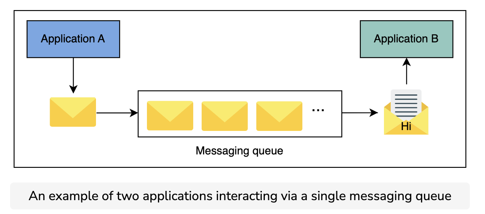
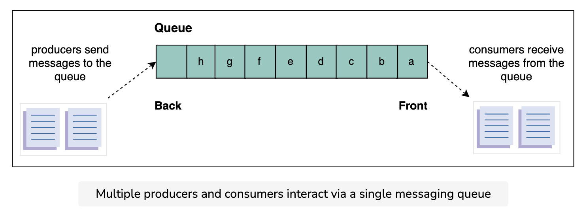
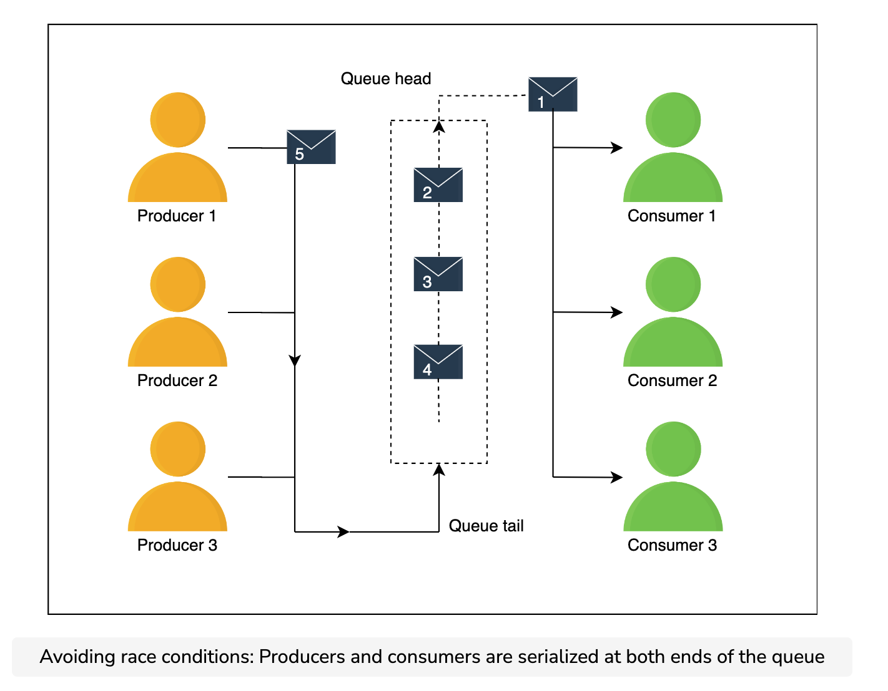
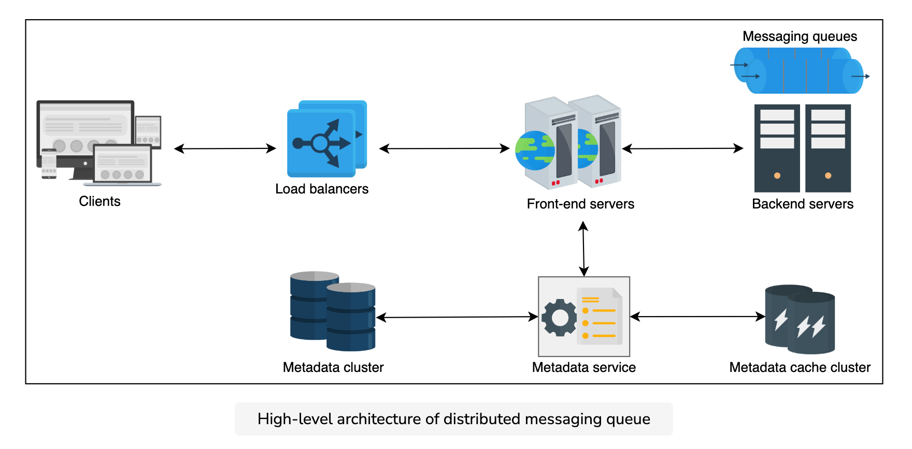

### Intro
A messaging queue is an intermediate component between the interacting entities known as producers and consumers. The producer produces messages and places them in the queue, while the consumer retrieves the messages from the queue and processes them. There might be multiple producers and consumers interacting with the queue at the same time.

#### Why?
* Improved performance: Improved performance: A messaging queue enables asynchronous communication between the two interacting entities, producers and consumers, and eliminates their relative speed difference. A producer puts messages in the queue without waiting for the consumers. Similarly, a consumer processes the messages when they become available. Moreover, queues are often used to separate out slower operations from the critical path and, therefore, help reduce client-perceived latency. For example, instead of waiting for a specific task that’s taking a long time to complete, the producer process sends a message, which is kept in a queue if there are multiple requests, for the required task and continues its operations. The consumer can notify us about the fate of the processing, whether a success or failure, by using another queue.

* Better reliability: The separation of interacting entities via a messaging queue makes the system more fault tolerant. For example, a producer or consumer can fail independently without affecting the others and restart later. Moreover, replicating the messaging queue on multiple servers ensures the system’s availability if one or more servers are down.

* Granular scalability: Asynchronous communication makes the system more scalable. For example, many processes can communicate via a messaging queue. In addition, when the number of requests increases, we distribute the workload across several consumers. So, an application is in full control to tweak the number of producer or consumer processes according to its current need.

* Easy decoupling: A messaging queue decouples dependencies among different entities in a system. The interacting entities communicate via messages and are kept unaware of each other’s internal working mechanisms.

* Rate limiting: Messaging queues also help absorb any load spikes and prevent services from becoming overloaded, acting as a rudimentary form of rate limiting when there is a need to avoid dropping any incoming request.

* Priority queue: Multiple queues can be used to implement different priorities—for example, one queue for each priority—and give more service time to a higher priority queue.

#### Use cases
A messaging queue has many use cases, both in single-server and distributed environments. For example, it can be used for interprocess communication within one operating system. It also enables communication between processes in a distributed environment. Some of the use cases of a messaging queue are discussed below.

* Sending many emails: Emails are used for numerous purposes, such as sharing information, account verification, resetting passwords, marketing campaigns, and more. All of these emails written for different purposes don’t need immediate processing and, therefore, they don’t disturb the system’s core functionality. A messaging queue can help coordinate a large number of emails between different senders and receivers in such cases.

* Data post-processing: Many multimedia applications need to process content for different viewer needs, such as for consumption on a mobile phone and a smart television. Oftentimes, applications upload the content into a store and use a messaging queue for post-processing of content offline. Doing this substantially reduces client-perceived latency and enables the service to schedule the offline work at some appropriate time—probably late at night when the compute capacity is less busy.

* Recommender systems: Some platforms use recommender systems to provide preferred content or information to a user. The recommender system takes the user’s historical data, processes it, and predicts relevant content or information. Since this is a time-consuming task, a messaging queue can be incorporated between the recommender system and requesting processes to increase and quicken performance.

### Requirements
**Functional**
* Queue creation: The client should be able to create a queue and set some parameters—for example, queue name, queue size, and maximum message size.

* Send message: Producer entities should be able to send messages to a queue that’s intended for them.

* Receive message: Consumer entities should be able to receive messages from their respective queues.

* Delete message: The consumer processes should be able to delete a message from the queue after a successful processing of the message.

* Queue deletion: Clients should be able to delete a specific queue.

**Non-functional**
* Durability: The data received by the system should be durable and shouldn’t be lost. Producers and consumers can fail independently, and a queue with data durability is critical to make the whole system work, because other entities are relying on the queue.

* Scalability: The system needs to be scalable and capable of handling the increased load, queues, producers, consumers, and the number of messages. Similarly, when the load reduces, the system should be able to shrink the resources accordingly.

* Availability: The system should be highly available for receiving and sending messages. It should continue operating uninterrupted, even after the failure of one or more of its components.

* Performance: The system should provide high throughput and low latency.

**Distributed messaging queue building blocks**
* Database(s) will be required to store the metadata of queues and users.
* Caches are important to keep frequently accessed data, whether it be data pertaining to users or queues metadata.
* Load balancers are used to direct incoming requests to servers where the metadata is stored.

### Considerations
**Ordering of messages**
Need for messages to be ordered properly. Two efforts to order properly:

1. best-effort ordering
2. strict ordering

**Best-effort**
Messages put in same order as they are received. Example, producer sends A,B,C,D. Due to network issues the queue receives them in A,C,D,B. They are then put in queue in this same order.

**Strict**
Queue system provides essential libraries or APIs for client producers to give a sequence number.

Example approaches for providing a sequence:

1. Monotonically increasing numbers

2. Causality-based: messages sorted based on the timestamp that was product on client side. Drawback = multiple clients can have slightly different clock times.

3. Timestamps based on synchronized clicks

**Sorting**
Perform online sorting within a time-window approach to reduce latency.

**Concurrency**
One solution is to serialize requests using the system's buffer at both ends of the queue so that incoming messages are placed in an order and consumer processes also receive messages in their arrival sequence.

### High level design
Queue data is replicated using either a primary-secondary or quorum-like system inside a cluster (read through the Data Replication lesson for more details). Our service can use data partitioning if the queue gets too long to fit on a server. We can use a consistent hashing-like scheme for this purpose, or we may use a key-value store where the key might be the sequence numbers of the messages. In that case, each shard is appropriately replicated (refer to the Partition lesson for more details on this).

We also assume that our system can auto-expand and auto-shrink the resources as per the need to optimally utilize resources.

### Backend
**Primary-secondary model**
In the primary-secondary model, each node is considered a primary host for a collection of queues. The responsibility of a primary host is to receive requests for a particular queue and be fully responsible for data replication. The request is received by the frontend, which in turn communicates with the metadata service to determine the primary host for the request.

For example, suppose we have two queues with the identities 101 and 102 residing on four different hosts A, B, C, and D. In this example, instance B is the primary host of queue 101 and the secondary hosts where the queue 101 is replicated are A and C. As the frontend receives message requests, it identifies the primary server from the internal cluster manager through the metadata service. The message is retrieved from the primary instance, which is also responsible for deleting the original message upon usage and all of its replicas.

As shown in the following illustration, the internal cluster manager is a component that’s responsible for mapping between the primary host, secondary hosts, and queues. Moreover, it also helps in the primary host selection. Therefore, it needs to be reliable, scalable, and performant.

**Independent hosts**
In the approach involving a cluster of independent hosts, we have several clusters of multiple independent hosts that are distributed across data centers. As the frontend receives a message, it determines the corresponding cluster via the metadata service from the external cluster manager. The message is then forwarded to a random host in the cluster, which replicates the message in other hosts where the queue is stored.

The same process is applied to receive message requests from the consumer. Similar to the first approach, the randomly selected host is responsible for message delivery and cleanup upon a successful processing of the message.

Furthermore, another component called an external cluster manager is introduced, which is accountable for maintaining the mapping between queues and clusters, as shown in the following figure. The external cluster manager is also responsible for queue management and cluster assignment to a particular queue.

The following figure illustrates the cluster of independent hosts. There are two clusters, A and B, which consist of several nodes. The external cluster manager has the mapping table between queues and their corresponding cluster. Whenever a frontend receives a request for a queue, it determines the corresponding cluster for the queue and forwards the request to the cluster where the queue resides. The nodes within that cluster are responsible for storing and sending messages accordingly.

### Conclusion
We discussed many subtleties in designing a FIFO queue in a distributed setting. We saw that there is a trade-off between strict message production, message extraction orders, and achievable throughput and latency. Relaxed ordering gives us a higher throughput and lower latency. Asking for strict ordering forces the system to do extra work to enforce wall-clock or causality-based ordering. We use different data stores with appropriate replication and partitioning to scale with data. This design exercise highlights that a construct, a producer-consumer queue, that’s simple to realize in a single-OS based system becomes much more difficult in a distributed setting.
