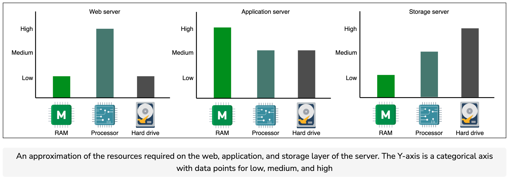
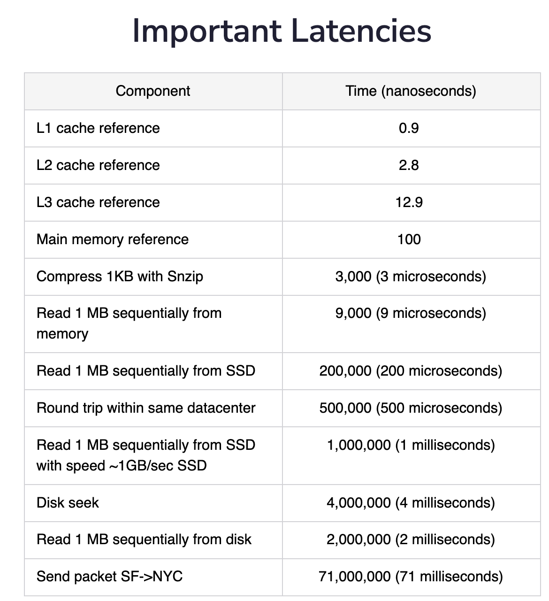
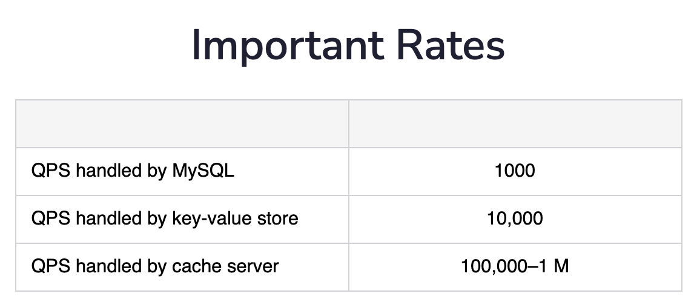
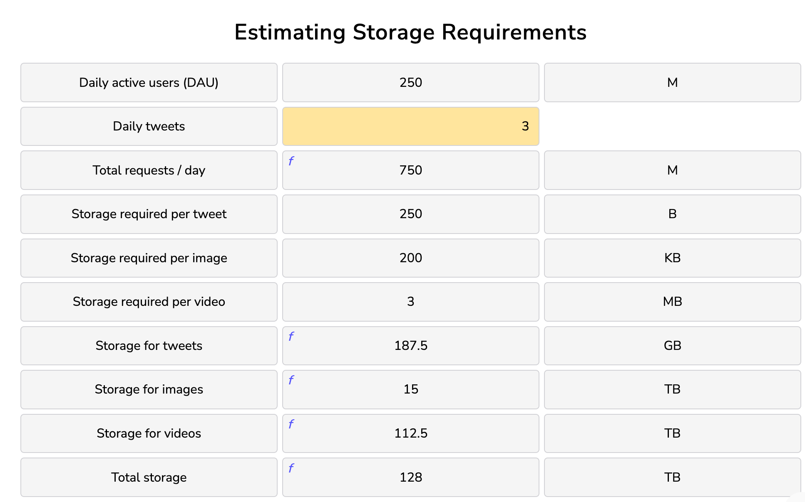
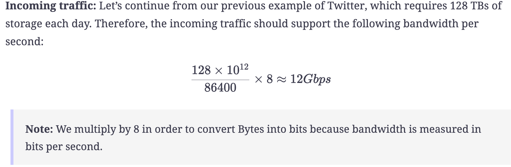
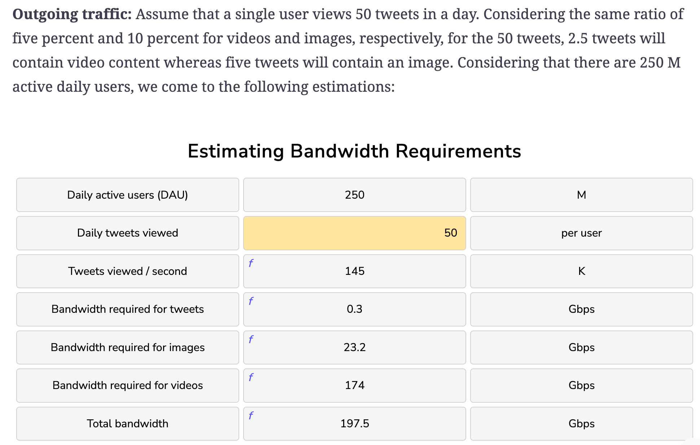

## Notes

### Abstractions

#### Network Abstractions: Remote Procedure Calls
Remote procedure calls (RPCs) provide an abstraction of a local procedure call to the developers by hiding the complexities of packing and sending function arguments to the remote server, receiving the return values, and managing any network retries.

RPC is an interprocess communication protocol that’s widely used in distributed systems. In the OSI model of network communication, RPC spans the transport and application layers.

RPC mechanisms are employed when a computer program causes a procedure or subroutine to execute in a separate address space.

##### Summary
The RPC method is similar to calling a local procedure, except that the called procedure is usually executed in a different process and on a different computer.

RPC allows developers to build applications on top of distributed systems. Developers can use the RPC method without knowing the network communication details. As a result, they can concentrate on the design aspects, rather than the machine and communication-level specifics.

### Non-functional System Characteristics

#### Availability
Availability is the percentage of time that some service or infrastructure is accessible to clients and is operated upon under normal conditions. For example, if a service has 100% availability, it means that the said service functions and responds as intended (operates normally) all the time.

Mathematically, availability, A, is a ratio. The higher the A value, the better.
​

#### Reliability
Reliability, R, is the probability that the service will perform its functions for a specified time. R measures how the service performs under varying operating conditions. We often use mean time between failures (MTBF) and mean time to repair (MTTR) as metrics to measure R.

#### Scalability
Scalability is the ability of a system to handle an increasing amount of workload without compromising performance. A search engine, for example, must accommodate increasing numbers of users, as well as the amount of data it indexes.

#### Maintainability
Besides building a system, one of the main tasks afterward is keeping the system up and running by finding and fixing bugs, adding new functionalities, keeping the system’s platform updated, and ensuring smooth system operations. One of the salient features to define such requirements of an exemplary system design is maintainability. We can further divide the concept of maintainability into three underlying aspects:

1. Operability: This is the ease with which we can ensure the system’s smooth operational running under normal circumstances and achieve normal conditions under a fault.
2. Lucidity: This refers to the simplicity of the code. The simpler the code base, the easier it is to understand and maintain it, and vice versa.
3. Modifiability: This is the capability of the system to integrate modified, new, and unforeseen features without any hassle.

#### Fault Tolerance
Real-world, large-scale applications run hundreds of servers and databases to accommodate billions of users’ requests and store significant data. These applications need a mechanism that helps with data safety and eschews the recalculation of computationally intensive tasks by avoiding a single point of failure.

Fault tolerance refers to a system’s ability to execute persistently even if one or more of its components fail. Here, components can be software or hardware. Conceiving a system that is hundred percent fault-tolerant is practically very difficult.

Let’s discuss some important features for which fault-tolerance becomes a necessity.

Availability focuses on receiving every client’s request by being accessible 24/7.

Reliability is concerned with responding by taking specified action on every client’s request.

##### Techniques
Failure occurs at the hardware or software level, which eventually affects the data. Fault tolerance can be achieved by many approaches, considering the system structure. Let’s discuss the techniques that are significant and suitable for most designs.

##### Replication
One of the most widely-used techniques is replication-based fault tolerance. With this technique, we can replicate both the services and data. We can swap out failed nodes with healthy ones and a failed data store with its replica. A large service can transparently make the switch without impacting the end customers.

We create multiple copies of our data in separate storage. All copies need to update regularly for consistency when any update occurs in the data. Updating data in replicas is a challenging job. When a system needs strong consistency, we can synchronously update data in replicas. However, this reduces the availability of the system. We can also asynchronously update data in replicas when we can tolerate eventual consistency, resulting in stale reads until all replicas converge. Thus, there is a trade-off between both consistency approaches. We compromise either on availability or on consistency under failures—a reality that is outlined in the CAP theorem.

##### Checkpointing
Checkpointing is a technique that saves the system’s state in stable storage when the system state is consistent. Checkpointing is performed in many stages at different time intervals. The primary purpose is to save the computational state at a given point. When a failure occurs in the system, we can get the last computed data from the previous checkpoint and start working from there.

Checkpointing also comes with the same problem that we have in replication. When the system has to perform checkpointing, it makes sure that the system is in a consistent state, meaning that all processes are stopped. This type of checkpointing is known as synchronous checkpointing. On the other hand, checkpointing in an inconsistent state leads to data inconsistency problems. Let’s look at the illustration below to understand the difference between a consistent and an inconsistent state:

### Back of the envelope

#### In perspective
A distributed system has compute nodes connected via a network. There’s a wide variety of available compute nodes and they can be connected in many different ways. Back-of-the-envelope calculations help us ignore the nitty-gritty details of the system (at least at the design level) and focus on more important aspects.

Some examples of a back-of-the-envelope calculation could be:

* The number of concurrent TCP connections a server can support.
* The number of requests per second (RPS) a web, database, or cache server can handle.
* The storage requirements of a service.

Choosing an unreasonable number for such calculations can lead to a flawed design. Since we need good estimations in many design problems, we’ll discuss all the relevant concepts in detail in this lesson. These concepts include:

* The types of data center servers.
* The realistic access latencies of different components.
* The estimation of RPS that a server can handle.
Examples of bandwidth, servers, and storage estimation.

##### Web servers
For scalability, the web servers are decoupled from the application servers. Web servers are the first point of contact after load balancers. Data centers have racks full of web servers that *usually handle API calls from the clients*. Depending on the service that’s offered, the memory and storage resources in web servers can be small to medium. However, such servers require good computational resources. For example, Facebook has used a web server with 32 GB of RAM and 500 GB of storage space. But for its high-end computational needs, it partnered with Intel to build a custom 16-core processor.

##### Application servers
Application servers run the core application software and business logic. The difference between web servers and application servers is somewhat fuzzy. Application servers primarily provide dynamic content, whereas web servers mostly serve static content to the client, which is mostly a web browser. They can require extensive computational and storage resources. Storage resources can be volatile and non-volatile. Facebook has used application servers with a RAM of up to 256 GB and two types of storage—traditional rotating disks and flash—with a capacity of up to 6.5 TB.

##### Storage servers
With the explosive growth of Internet users, the amount of data stored by giant services has multiplied. Additionally, various types of data are now being stored in different storage units. For instance, YouTube uses the following datastores:

Blob storage for its encoded videos.
A temporary processing queue storage that can hold a few hundred hours of video content uploaded daily to YouTube for processing.
Specialized storage called Bigtable for storing a large number of thumbnails of videos.
Relational database management system (RDBMS) for users and videos metadata (comments, likes, user channels, and so on.
Other data stores are still used for analytics—for example, Hadoop’s HDFS. Storage servers mainly include structured (for example, SQL) and non-structured (NoSQL) data management systems.

Coming back to the example of Facebook, we know that they’ve used servers with a storage capacity of up to 120 TB. With the number of servers in use, Facebook is able to house exabytes of storage.

##### Request estimation
This section discusses the number of requests a typical server can handle in a second. Within a server, there are limited resources and depending on the type of client requests, different resources can become a bottleneck. Let’s understand two types of requests.

CPU-bound requests: These are the type of requests where the limiting factor is the CPU.
Memory-bound requests: These are the types of requests that are limited by the amount of memory a machine has.
Let’s approximate the RPS for each type of request. But before that, we need to assume the following:

Our server has the specifications of the typical server that we defined in the table above.
* Operating systems and other auxiliary processes have consumed a total of 16 GB of RAM.
* Each worker consumes 300 MBs of RAM storage to complete a request.
*  For simplicity, we assume that the CPU obtains data from the RAM. Therefore, a caching system ensures that all the required content is available for serving, without there being a need to access the storage layer.
* Each CPU-bound request takes 200 milliseconds, whereas a memory-bound request takes 50 milliseconds to complete.

Let’s do the computation for each type of request.

#### Example of resource estimation

##### Storage

##### Bandwidth

