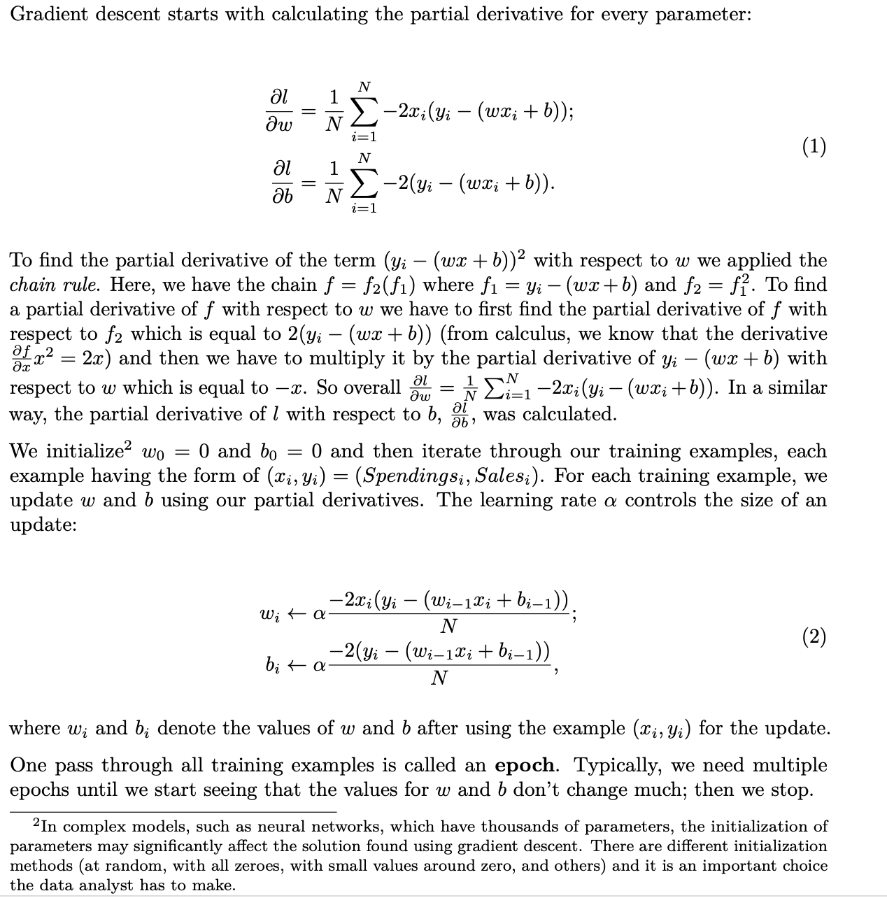
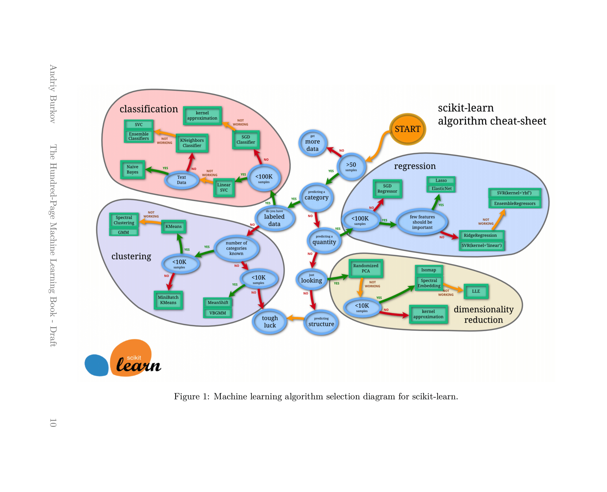
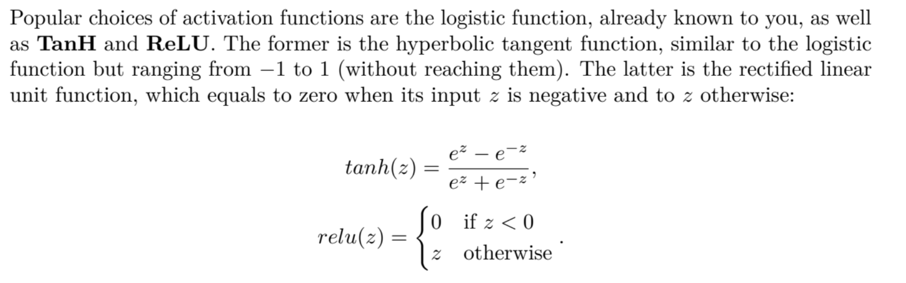
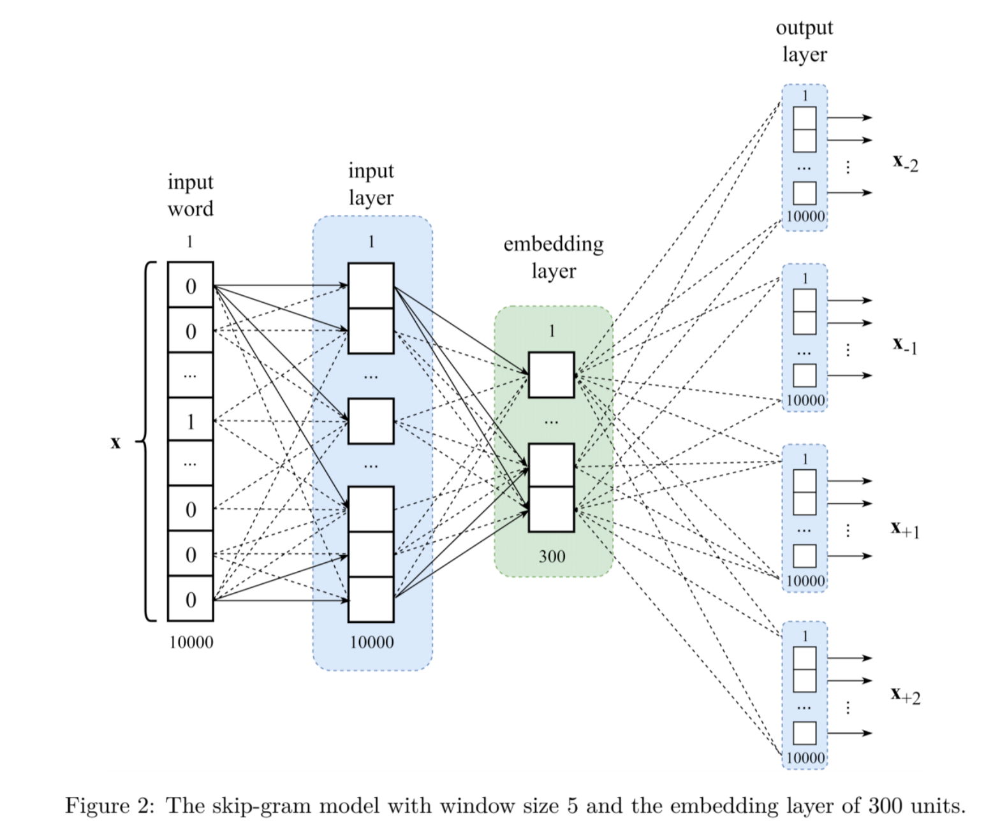

## [Book pdf](http://ema.cri-info.cm/wp-content/uploads/2019/07/2019BurkovTheHundred-pageMachineLearning.pdf)
## [Other github link](https://github.com/Chrisackerman1/The-Hundred-Page-Machine-Learning-Book)

## Chapter 1

Easy dicussion of different learning types.

#### Supervised learning
At this point, you should retain the following: any classification learning algorithm that
builds a model implicitly or explicitly creates a decision boundary. The decision boundary
can be straight, or curved, or it can have a complex form, or it can be a superposition of
some geometrical figures.

In practice, there are two other essential dierentiators of learning algorithms to consider:
speed of model building and prediction processing time. In many practical cases, you would
prefer a learning algorithm that builds a less accurate model fast. Additionally, you might
prefer a less accurate model that is much quicker at making predictions.

## Chapter 2

Extremely helpful, accessible reminder of math concepts: notation, derivation, chain rule, random variables, mean, std deviation, interals

Unbiased estimator = often we do not know _f_(x), but have samples. 

Parameter vs. instance-based models: parameter = has parameters, instance = used all samples (e.g., kNN)

## Chapter 3: Fundamental Algorithms

* No continuous derivative = function not smooth. Functions that are not smooth create unnecessary diculties when employing linear algebra to find closed form solutions to optimization problems. Closed form solutions to finding an optimum of a function are simple algebraic expressions and are often preferable to using complex numerical optimization methods, such as gradient descent (used, among others, to train neural networks).

* Finally, why do we care about the derivative of the average loss? Remember from algebra that if we can calculate the gradien of the function in eq. 2, we can then set this gradient to zero2 and find the solution to a system of equations that gives us the optimal values **w** and **b**. 

### Logisitc regression
* Leverage simoid function = 1/(1+e^-x) to keep output values [0, 1]
* So our model = 1/(1+e^-(wx+b))
* In linear regression we minimized MSE. In logistic instead of using squared loss we maximize the likelihood of training set according to the model. I.e., in stats likliehood function defines how likely the observations are according to our model.
* Optimization criterion = **maximum likliehood**: 

L = Product( f(x)^y * (1-f(x))^(1-y) )
--> maximize log(liklihood) = Sum( y*ln(f(x)) + (1-y)*ln(1-f(x))

Contrary to linear regression, there's no closed form solution to the above optimization problem. Typically numerical optimization procedure used in such cases is gradient descent.

### Decision trees
* Non-parametric model
* Focus on ID3 learning algo
  1. search through all features j= 1,..,_D_ and at all thresholds _t_, and split the set _S_ into two subsets
  2. evaluate potential split
  3. choose best split

#### Goodness of split
* For ID3, estimated using entropy
* Entropy = measure of uncertainty about a random variable
* Reaches maximum when all values of the RV are equiprobable
* Reaches minimum when value of random variable can only have one value
* Entropy = H(S) = -_f_*ln(_f_) - (1 - _f_)*ln(1-_f_)
* Entropy for a given feature and threhsold is weighted sum of the two entropies
* H(S-,S+) = |S-|/|S|*H(S-) + |S+|/|S|*H(S+)

### Support Vector Machine
* To extend SVM to cases with data no linearly seperable we introduce the hinge loss function = max(0, 1-y(wx-b))
* Hinge = 0 for data on correct side of decision boundary
* For data on wrong side, function's value is proportional to distance from decision boundary
* Goal is then to minimize following cost function:

`C||w||^2 + 1/N SUM( max(0, 1-y(wx-b))`

* Hyperparam C determines tradeoff between increasing size of decision boundary and ensuring x lies on correct side
* SVMs that optimize hinge loss = soft-margin SVMs
* C regulates tradeoff b/w classifiying training data well vs. generalizing

#### Dealing with non-linearity
* Goal = transform original space into space of higher dimensionality, which we hope is then linearly separable
* In SVM, use a function to implicitly transform original space into higher dimension during the cost function optimization = **kernel trick**
* But finding explicit mapping is hard
* Instead, use kernel functions to efficiently work in higher-dimensional space without doing so explicitly

* Traditional method to solve optimization problem in SVM is method of Lagrane multipliers
* Instead of solving original problem, formulate as <see pdf>
* Essentially we find out we are only interested in the dot-product between feature vectors
* Most widely used kernel is RBF (radial basis function)

`k(x, x') = exp(- ||x - x'||^2 / 2sigma^2)`

where ||x - x'||^2 = squared euclidean distance between two feature vectors

### k-Nearest Neighbors
* Non-parametric learning algorithm
* Keep all training examples in memory
* Once new unseen example comes, find k training examples closest, return majority label

* **Closeness** defined by distance function. Could be euclidean, cosine, etc.
* Cosine similarity = x.y / |x|*|y|

## Chapter 4: Anatomy of a learning algorithm

Three basic parts
* a loss function
* an optimization criterion based on the loss function (e.g., cost function)
* an optimization routine leveraging training data to find solution to optimization criterion

Gradient descent
* used to find optimal parameters for linear and logistic regression, SVM, neural networks, etc.
* many models, such as logistic regression or SVM, the optimization criterion is convex
* convex functions have only one minimum, which is global. Optimization criteria for neural networks are not convex, but inpractice even finding a local minimum suffices

* The gradient descent algorithm is sensitive to the choice of the step –. It is also slow for large datasets. Fortunately, several significant improvements to this algorithm have been proposed. Stochastic gradient descent (SGD) is a version of the algorithm that speeds up the computation by approximating the gradient using smaller batches (subsets) of the training data. SGD itself has various “upgrades”. Adagrad is a version of SGD that scales – for each parameter according to the history of gradients.As a result, – is reduced for very large gradients and vice-versa. Momentum is a method that helps accelerate SGD by orientingthe gradient descent in the relevant direction and reducing oscillations. In neural network training, variants of SGD such as RMSprop and Adam, are most frequently used.

## Chapter 5: basic practice

* Standardization vs. normalization
  * in practice for unsupervised standardization > normalization
  * also preferred for a feature that can have extreme outliers as it will "squeeze" the normal values into small range
  * most other cases, noramlization is preferred

* Data imputation
  * obviously can replace with average, median, etc.
  * more advanced approach is to treat missing feature value as a regression problem

* Three sets
  * training set = biggest, build model
  * validation set = roughly same size as test, use to choose learning algo and hyperparams
  * test set = true gauge of model performance

* Regularization
  * l1 = lasso, sparse, feature selection
  * l2 = ridge
  * also elastic net which is combo ofboth

* Evaluation
  * preicsion = TP / (TP + FP)
  * recall = TP / (TP + FN)
  * if wanting to do these for multi-class, pick a class you care about, set to 1 and treat all other classes as 0
  * accuracy = (TP + TN) / (TP + TN + FP + FN)
  * area under roc curve:
    * TPR = TP / (TP + FN)
    * FPR = FP / (FP + TN)
* Tuning
  * easy approach is grid search on hyperparams
  * train on train set, select params based on validation, understand performance on test

* Cross-validation
  * when you don't have decent validation set to tune hyperparams, common to us cross-validation
  * e.g., 5 fold CV

## Chapter 6: Neural networks

* Activation fn
  * Differentiable for gradient descent
  * Nonlinear component = allow neural network to approximate nonlinear functions
  * Without nonlinearities, _f_neural_network would be linear no matter how many layers
  * I.e., linear function of a linear function = linear

* Historic problems
  * exploding gradients: easier to deal with using easy techniques like gradient clipping, l1/l2 regularization
  * vanishing gradients: traditionally more difficult to deal with

* Vanishing radient
  * in some cases, gradient will be vanishingly small = effectively preventing some parameters from changing their value
  * worse case = completely stop NN from further training

* Traditional activation functions
  * E.g., hyperbolic tangent has gradients in range (0,1) and so backpropogation computes by chain rule
  * Effect = multiplying n of these small numbers to compute gradients of the earlier (leftmost) layers in a _n_-layer network means that gradient decreases expoentially with _n_
  * Result is that the effect that the earlier layers train very slow, if at all

* Modern techniques
  * Modern implementations allow to train very deep architectures
  * This includes ReLU, LSTM (and other gated united), skip connections, + other advanced modifictions of gradient descent algo
  * In practice, many business problems can be solved with NN having 2-3 layers b/w the input and output

* Growing size
  * as you add layers, you add (size_l-1 + 1)*size_l parameters
  * E.g., if you add another 1000-unit layer to an existing network, then you add more than 1 million additional parameters to your model

* Convolutional neural network
  * significantly reduces number of parameters in DNN
  * mostly used in imag eand text
  * see book for depictions on how convultional filters are used

* Recurrent neural network (RNN)
  * used to label, classify, generate sequences
  * sequence = a matrix, each row of which is a feature vector and the order of rows matters
  * not feed-forward: contains loops
  * each unit _u_ of a recurrent layer _l_ has a real-valued **state** h_l,u
  * state can be seen as the memory of the unit
  * in RNN, each unit _u_ in each layer _l_ receives two inputs: a vector of states from the previous layer _l_ - 1 and the vector of states from this same layer _l_ from the previous time state
  * backpropagation through time = from pov of gradient calculation, longer the input sequence, the deeper is the unfolded network
  * as length of the input sequence grows, the feature vectors from the beginning of the sequence tend to be "forgotten" because the state of each unit, which serves as the network's memory, becomes significantly affected by the feature vectors read more recently
  * most effective are **gated RNNs**, which includes **long short-term memory (LSTM)** and networks based on the **gated recurrent unit (GRU)**

## Chapter 7: Problems & Solutions

* Multiclass classification
  * one solution = extending by using softmax function instead of sigmoid
  * others are more straightforward (think kNN)
  * what should you do if you have multiclass problem, but binary classifiction? one strategy = **one versus rest**

* Binary cross-entropy
  * = -(y*ln(y_hat)) + (1-y)*ln(1-y_hat)

* Boosting & bagging
  * boosting = original training data and iteratively creating multiple models by using a weak learner. build each model to try and "Fix" errors in previous
  * bagging = creating many copies of training data and then apply weak learner to each copy to obtain multiple weak mobels and then combine, example = random forest

* Random Forest
  * vanilla bagging algo works as follows: create B random samples of the training set and build ecision tree model using each
  * sample with replacement
  * after training we have _B_ decision trees. decision is average from the _B_ predictions
  * random forest is different from vanilla bagging in just one way: at each split only a random subset of features are used.
  * doing so avoids correlation b/w trees
  * reduces variance = reduces overfitting

* Gradient Boosting
  * build initial model, compute y_hat = y - _f_(x)
  * y_hat is now **residual**
  * use modified training set, with residuals instead of original labels to build a new decision tree model
  * so then boosting model is now f_0 + alpha*f_1 where alpha is a hyperparam
  * continue on & on, e.g., next round will be _f_ = f_0 + alpha*f_1 + alpha*f_2
  * instead of computing gardient directly we use its proxy in the form of residual
  * boosting reduces the bias (or underfitting) instead of the variance as in bagging
  * gradient boosting for classification is similar but slightly different
  * assume _M_ regression decision trees. Similar to logistic regresison, the prediction of the ensemble of decision trees is modeled using the sigmoid function
  * P = 1 / (1+e-(_f_(x)))
  * where _f_(x) = SIGMA (f_m(x)) and each f_m is a regression tree
  * to learn, start with _f_ = p / (1-p)
  * at each iteration, a new tree f_m is added to the model
  * to find the best f_m, first the partial derivative g_i of the current model is calcualted for each sample
  * partial is = 1 / (exp^(f(x)) + 1)
  * transform our training set by replacing the original label y with the corresponding partial and build a new tree
  * then find optimal rho = argmax rho (overall likelihood)
  * then update ensemble model f = f + alpha*rho*f(previous tree)

* Sequence-to-sequence
  * generaliation of sequence labeling problem
  * in seq2seq, _X_ and _Y_ can have different lengths
  * two parts: encoder & decoder
  * encoder = read input and generate some sort of state, seen as numerical representation of the meaning of the input
  * decoder = take embedding input as is capable of generating sequence of outputs
  * both encoder and decoder traing simultaneously using training data. errors at the decoder output are propagated to the encoder via backprop
  * more accurate predictions can be obtained using an architecture with **attention**
  * attention mechanism is implemented by an additional set of parameters that combine some information from the encoder (in RNNs, this info is the list of state vectors of the last recurrent layer from all the encoder time steps) and the current state of the decoder to generate the label

* Active learning
  * supervised learning paradigm
  * usually applied when obtaining labeled examples is costly
  * start learning with relatively few labeled examples, and a large number of unlabeled ones
  * labeled only those examples that contribue the most to the model quality
  * (1) two strategies: data density and uncertainty based, (2) support vector based

* Semi-supervised
  * also have labeled a small fraction of the dataset
  * most remaining unlabeled
  * goal = leverage a large number of the unlabeled examples to improve model performance w/o asking for additional labeled examples
  * self-learning = build initial model using labeled, apply model to unlabeled, labeled them using the model
  * if confidence score of prediction is higher than threshold, then add it to labeled example, retrain model, and continue
  * other semi-supervised techniques exist. example building the model using labeled data, clustering unlabeled and unlabeled using any clustering technique --> for each example, output as a prediction the majority label in the cluster

## Chapter 8: Advanced practice

* Handling imbalanced
  * obvious choices --> use an algo that allows class weighting like SVM
  * next choice, over-sample or undersample
  * can also create synthetic samples via something like SMOTE

* Advanced regularization
  * besides obvious l1/l2: dropout, early stopping, batch-normalization
  * for images, data augmentation = create synthetic example from original example by applying various transformations to the original image (zooming, rotating, flipping, darkening, etc.)

* Transfer learning
  * pick existing model on some dataset * adapt to predict example from another dataset
  * train on original dataset, remove last one or several layers, freeze params of the layers from first model, train new layers

* Algo efficiency
  * i.e., use libraries that take advantage of operations on matrices and vectors vs. for loops :)

## Chapter 9: Unsupervised

* k-means
  * choose k clusters, initialize k random centroids
  * compute distance for each example to each centroid
  * assign sample to closest centroid
  * for each centroid, calculate average feature vector fo the examples
  * average feature vectors become new centroids
  * recompute distance --> modify assignments --> repeat until assignments do not change
  * can use elbow plot to determine number of clusters

* Gaussian mixture model (GMM)
  * allows each example to be a member of several cluster with different membership score (kind of like possibilistic k-means)
  * estimate n gaussian distribution for the _n_ clusters
  * expectation maximization algo
  * beginng = guess initial values for mu and sigma of the _n_ different clusters
  * for each iteration
  * calculate liliehood of each x_i using gaussian equation
  * use bayes rule for each example to calculate lilihood
  * then we have a parameter that reflects how lilely that our gaussian distribution produced the dataset
  * compute new value of mu and sigma
  * update params, etc. until params do not change > threshold
  * EM very similar to k-means
  * start with random, iteratively update each cluster params by averaging
  * only difference is that in GMM the assignment of a data sample to the cluster is soft (i.e., sample belong to cluster i by a certain val and cluster j by another)
  * then update to the new cluster values is not an average btu a **weight** average
  * cluster in GMM can be form of ellipse that have arbitrary elongation & rotation (k-means they are only circular)

* Hierarchical clustering
  * not really mentioned here, look back at academic notes, straightforward & costly

* Dimensionality reduction
  * (1) principal component analysis
  * (2) uniform manifold approximation & projection
  * (3) autoencoder

* Authencoder
  * already mentioned, use low-dimensional bottleneck layer as a new vector

## Chapter 10: Other forms of learning

* Word embeddings
  * word2vec and a version of this is skip-gram
  * word embedding goal = build a model which we can use to convert a one-hot encoding of a word into a word embedding
  * example: dictionary contains 10k words
  * one-hot vector for each word is 10k dimensional vector of all zeroes except for one dimension that contains 1
  * skip-gram = using a word to predict context
  * skip gram with a given window size = [x-3, x-2, x-1, x, x+1, x+2, x+3]
  * this type of learning is self-supervised: labeled examples get extracted from the unlabeled data such as text
  * output layer is softmax, cost function is negative log-liklihood
  * embedding for a word is obtained as the output fo the embedding layer with the one-hot encoding of the word is given as the input of the model

