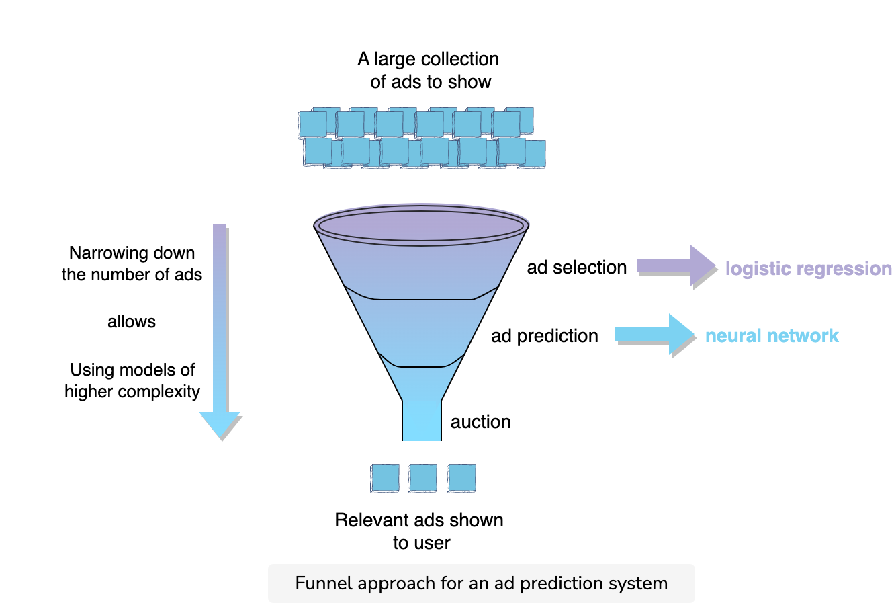

### Performance and Capacity Considerations

#### Major performance/capacity discussion come during two phases
  1. training time: how mjuch data and capacity is needed?
  2. evaluation time: what are the SLA that we have to meet while serving the model and capacity needs?

#### Complexities
* training complexity = time taken to train the model
* evaluation complexity = time taken to evaluate the input at test time
* sample complexity = total number of training samples to learn a target function successfully

#### Performance and capacity considerations
* Performance based SLA ensures we return results back within a given time frame (e.g., 500 ms) for 99% of queries
* Capacity refers to load that our system can handle e.g., system can support 1000 QPS
* This is where distributed systems come in handy; we will distribute the load of a single query among multiple shards, e.g., we divide the load among 1000 machines and can still execture our fast model on 100m documents ion 100ms

### Funnel based approach
* To manage performance and capacity, one approach is to start with a relatively fast model when you have the most candidates (e.g., 100 million documents)
* In every later stage we continue to increase model complexity, but on a filtered subset of candidates
* E.g., start with 100k candidates --> stage 1 ranker (logistic regression) --> stage 2 ranker (neural network)

## Training Data Collection Strategies

#### Collection techniques
* user's interactions with pre-existing system (online). e.g., start with a rule-based system in place, then build an ML solution with the data. aka, start with a v1 heuristic version, collect data, then use for model.
* human labelers (offline). e.g., send data to humans to generate labels, $$$ and slower. can be crowdsources, hired special labelers, open source.

#### Additional creative collection techniques
* build the product in a way that collects data from user
  * e.g., want to show personalized selection of pins on pinterest, but need semantic understanding of the user and the pin so weak system to (1) ask user to name the board, (2) ask new users to choose their interests in terms of the board names specific by existing users
* create manual expansion (i.e., perturb image data that already has labels, rotate, crop, etc.)

#### Train, test & validation splits
* training data = helps in training the ML model (fit model parameters)
* validation data = use for hyperparam evaluation
* test data = now with trained & tuned model, evaluate the generalization of performance on this set, this could help in go/no-go for A/B test
* time considerations: depending on context, might want to have train/validation split for earlier time periods then test on later time period

#### Removing bias
* when generating data through online user engagement, it may be biased
* removing bias is critical
* e.g., netflix: initial algo is show most popular movie --> user sees biased group of movie recs --> trained model will continue considering the previous top recommendations --> "rich getting richer" cycle continues
* in order to break the cycle, we need to employ an exploration technique. therefore we show **randomized** recommendations instead of "popular first" for a small portion of traffic to gather training data. 

#### Bootstrapping new items
* e.g., cold start problem --> need to rank a never-before seen type of ad
* solutions could be manually boosting it for some period / exploration

#### Online Testing
* see section, not going to take a/b notes
* long-running a/b tests can be done via backtest: aka, see improvement in treatment --> deploy, but maintain a small holdout set with the previous control approach

## Embeddings
* typically generated via neural network
* transfer learning refers to transferring information from one ML task to another
* e.g., building user embeddings from organic feed interactions on Twitter and using to rank ads
* another e.g., training word embeddings (like Word2vec) from Wiki data and using for spam-filtering models

##### Text embeddings

**Word2vec**
* produces word embeddigns by using shallow neural networks and self-supervised learning from a large corpus
* self-supervised as it trains a model by predicting words from other words that appear in the context
* representing words as a dense vector is critical in majority of NLP tasks
* word2vec simple but powerful, using neighboring words to predict the current word
* two networks to generate embeddings are
  1. **CBOW**: Continuous bag of words (CBOW) tries to predict the current word from its surrounding words by optimizing for the following loss function:
    $$Loss = -log(p(w_{t} | w_{t-n},...,w_{t-1},w_{t+1},...,w_{t+n}))$$

  where $n$ is the size of our window to look for the corresponding word. It uses the entire contextual information as one observation while training the network

   

  2. **Skipgram**: predict surrounding words from the current word. Loss function will be:
    $$Loss = -log(p(w_{t-n},...,w_{t-1},w_{t+1},w_{t+n} | w_{t}))$$

  where $n$ is size of the surrounding words that we are trying to predict. Model most helpful when we have a large training set. 

  

**Context-based embeddings**
* Once trained, Word2vec embeddings have a fixed vector for every term. So a Word2vec embedding doesn't consider the context in which the word appears to generate its embedding. However words in different context can have different meaning:
  1. I'd like to eat an apple.
  2. Apple makes great products

* Contextualized information can result in different meanings of the same word. Two popular architectures that generate context-based embedding are:
  1. Embeddings from Language Models (ELMo)
  2. Bidirectional Encoder Representations from Transformers (BERT)

**ELMO**
* uses the bi-directional LSTM model to capture the words that appear before and after the current word

**BERT**
* uses an attention mechanism and is able tos ee all the words in the context, utilizing only the ones (i.e., pay more attention) which help with the prediction. 

##### Visual embeddings
* not going to take notes for this section, though interesting!

##### Network/Relationship-based embedding
* most systems have multiple entities and these interact with each other. For example, Twitter has users that interact with tweets.
* we can think of these interactions as relationships in a graph or resulting interaction pairs --> (User, Tweet)
* having an embedding model that projects these documents in the same embedding space can vastly help with ranking and other tasks
* we can generate embeddings for the above pairs in the same space by creating a **two-two neural network** that tries to encode each item using their raw features
* model optimizes the inner product loss such that positive pairs from entity interactions have a higher score and random pairs have lower score
* assume selected pairs of entities belong to a set, **$A$**
* loss function will be:
  $$Loss = max(\sum_{(u,v) \in A} dot(u,v) - \sum_{(u,v) \notin A} dot(u,v))$$

  

## Transfer Learning
* taking pre-trained model and applying to new task

** techniques**
* extract features from useful layers: keep initial layers of the pre-trained model and remove the final layer. Add the new layer to the remaining chunk and train them for final classification
* fine-tuning: change or tune existing parameters in the pre-traing network, i.e., optimizing the model parameters during training for the supervised prediction task. how many layers to freeze and how many to fine-tune?

* which to choose?
  * if lots of training data --> option to unfreeze all and train
  * if minimal training data --> best to freeze params or fine-tune only last layer

## Debugging
  

#### Changing in feature distribution
* change in feature distribution of training and evaluation set can negatively affect the model performance
* e.g., train on wiki articles, serve on research papers --> feature distribution much different
* e.g., seasonality such as train of december data and serve january requests

#### Feature logging issues
* we assume features of the model generated offline would be same as online
* however way we generate features for online system might not be the same
* e.g., sometimes we append features offline to our training data for training then add them to online model serving
* check if feature generation logic is same

#### Iterative improvement
  

**Missing important feature**
* inspect missed predictions --> find useful feature (e.g., including feature with actor name to predict engagement)

**Top-down approach**
* view overall architecture and performance and big-block level
* when finding a portion that is under-performing, dive deep to solve
* repeat

