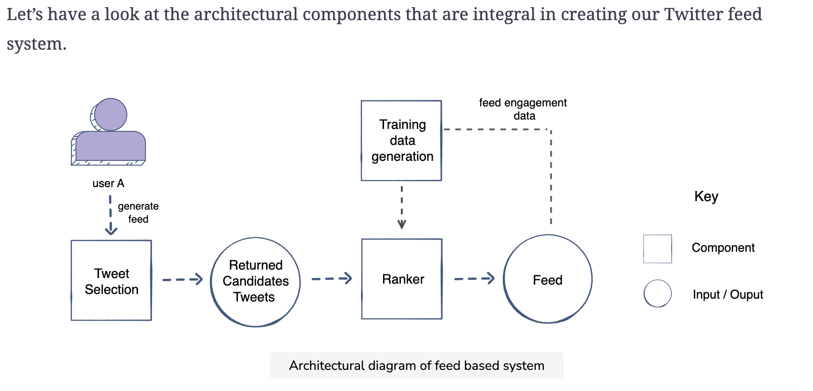
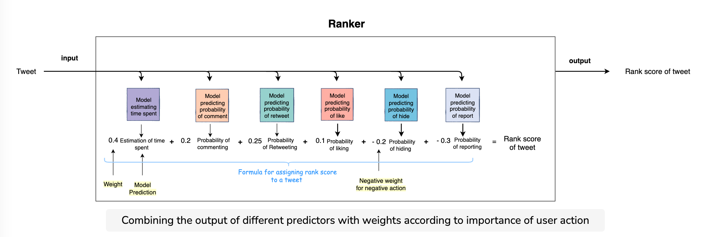
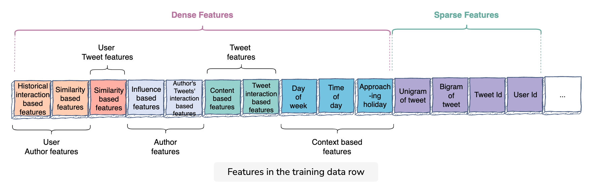
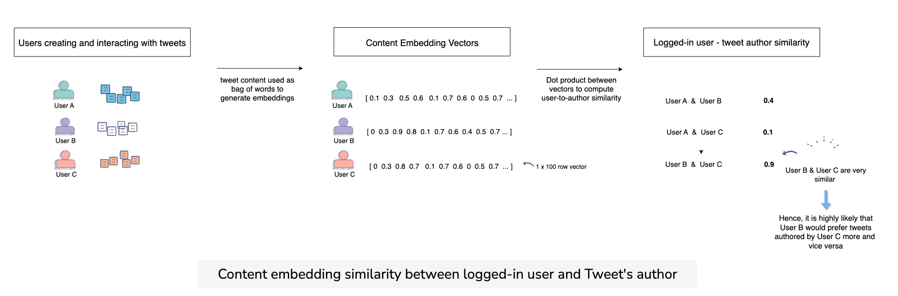
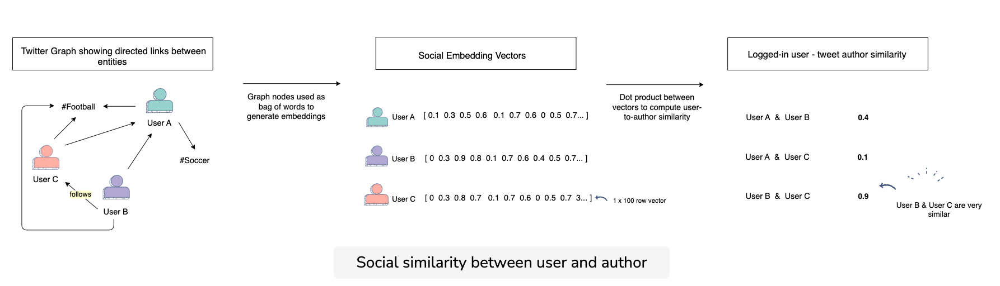
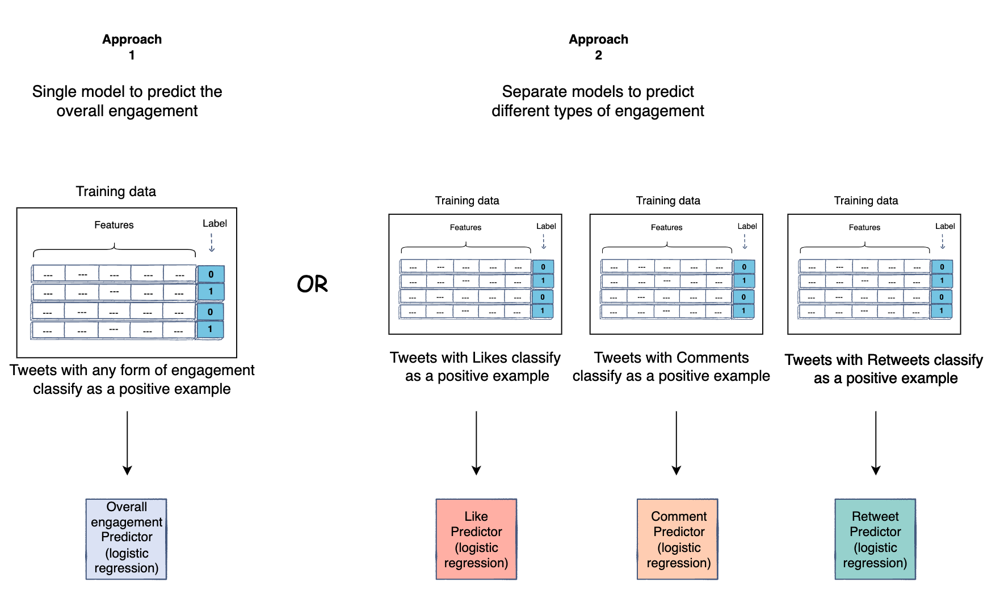
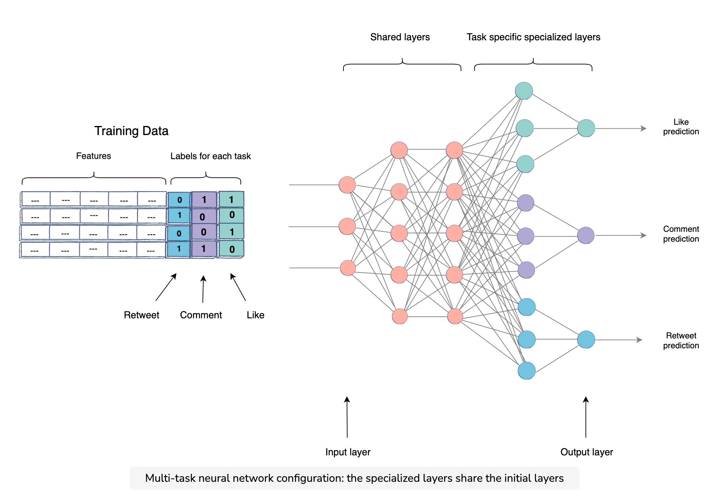
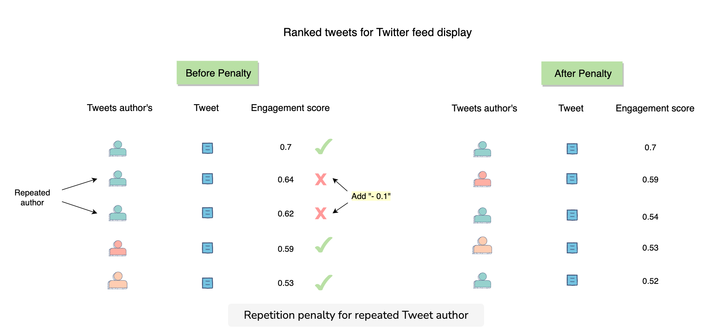
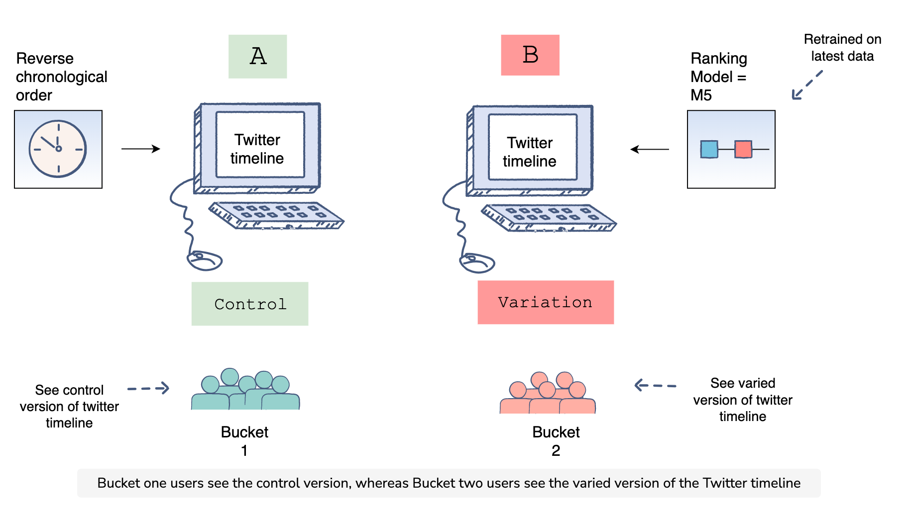

### Notes
* aka, essentially design twitter home feed
* basic high level design

* taking an ensemble model-type approach where we predict for P(action | tweet) for all action in {like, comment, report, etc.}
* example ranker

### Tweet Selection
* consider new (past X hours) and unseen tweets
* even if a tweet was previously seen during login, it might have generated more engagement + replies and so it is also considered
* tweet selection component fetches mix of newly generated tweets along with a portion of unseen tweets from cache
* edge case: 
  * not logged in for a long time, tweet selectio component might have a longer lookback period

**network tweets**
* also select out of network tweets that might be relevant for selection

## Feature engineering
* start by identifyinf four main actors in a feed:
  1. logged-in user
  2. tweet
  3. tweet's author
  4. context

### Dense features
**user-author features**
  * social relationship between user and author of tweet
  * e.g., use historical interactions
  * example features
    * author_liked_posts_3months: percentage of an author's tweets that are liked by user in the last three months
    * author_liked_posts_count_1year: number of an author's tweets that the user interacted with in last year
  * ideally these are normalized by the total number of tweets that the user interacted with during these periods

**user-author similarity**
* common_followees: show similarity between users
* topic_similarity: e.g., tf-idf based on similarity between hashtags
* tweet_content_embedding_similarity: user represented by the content they have generated and interactions with, utilize this to build a bag-of-words and build an embedding for every user. With an embedding vector for each user, the dot product between them can be used as a fairly good estimate of user-to-author similarity

* social_embedding_similarity: generate embeddings based on the social graph rather that content of tweets. basic way to train this model is to represent each user with all the other users and topics they follow in the social graph. Essentially, every user is represented by bag-of-ids (rather than bag-of-words) and you use that to train an embedding model. The user-author similarity will then be computed between their social embeddings and used as a signal.

**author features**
* is_verified
* author_social_rank
* author_num_followers: number of followers (and normalize!)
* follower_to_following_ratio
* author_engagement_rate_3months: engagement rate for historical tweets by author
* author_topic_engagement_rate_3months: engagement rate for this specific topic

**user-tweet features**
* similarity between the user's interested and the tweet's topic
* topic_similarity: compute tf-idf similarity with the previously-engaged tweets and this new tweet
* embedding_similarity: generated embedding for the user and the tweet. the tweet's embedding can be made based on the content and hashtag in it, while user embedding can be made based on the content and hashtag of tweets they have written or interacted with. Dot product between these embeddings can be calculated to measure similarity

**tweet features**
* tweet_length
* tweet_recency
* is_image_video
* is_url
* num_total_interactions (use time-decay to not over-favor popular tweets from a long period ago)
  * e.g., weight every interaction (like, comment, retweet) by $\dfrac{1}{t+1}$ where $t$ is the number of days from current time
  * alternatively, just use a different time window
  * e.g.,
    * interactions_in_last_1_hour
    * interactions_in_last_1_day
    * interactions_in_last_3_days
* do this for the different types of interactions
  * e.g., likes_in_last_3_days, comments_in_last_1_day, etc.
* also do this for users in and out of user's network
  * likes_in_last_3_days_in_network, comments_in_last_1_day_in_network

**context-based features**
* day_of_week
* time_of_day
* current_user_location
* season
* approaching_holiday

### Sparse features
* unigrams/bigrams of tweet
* user_id
* tweets_id

### Training Data Generation
* balancing classes
  * common approach = randomly downsample negative class
  * note: because are sampling class distribution this will mean output predictions are not _well calibrated_ (i.e., instead of picking a base 5% engagement, it might predict 50%)
  * this does not matter for our use case, but would for ads systems (see later chapters)

* train-test split
  * possibly:  
    * randomly select 2/3 for training
    * rest 1/3 for validation and testing
  * but, this would have bleed of dates and so we will train model on one time interval and validate on another time interval

### Modeling options
* logistic regression: fast to train, easily see impact of features, easily interpretable
  * assume linearity between input features and prediction, so takes manual effort to create polynomial features

* boosted trees / random forest: able to utilize non-linear interactions, don't require large amount of data to generalize well
  * hyperparams: number of trees, max depth, min samples for split, max feature for split

* deep learning: most powerful, computationally expensive
  * might employ a two stage approach as a result
    * stage 1: logistic regression ranker on 100k tweets
    * stage 2: neural network ranker on top 500 from previous stage
  * hyperparams: learning rate, # hidden layers, batch size, number epochs, dropout rate
  * can train separate neural nets for each task i.e., for each of P(like), P(comment), P(retweet)
  * but since this takes a long time for each separate task, we can use an alternative approach: **multi-task learning**
  * multi-task neural networks: train a neural network with shared layers (for shared knowledge) appended with specialized layers for each task's prediction. The weights of the shared layers are common to the three tasks, whereas the task-specific layer, the network learns based on that specific task.
    * the loss function for this model will be the sum of the individual losses for all tasks
    * total_loss = like_loss + common_loss + retweet_loss

* stacking models: i.e., output of tree becomes boolean features which is then input into a secondary model
  * could also be done for neural nets (i.e., input last year of model vs. sending to final output neuron)

### Diversity
* goal = reduce monotony of the user's feed
* to rid twitter from repitive predictions, introduce repitition penalty
* can do this in heuristic way: e.g., add negative weight to the score upon reptition
* or, simply bring them down in list

### Experimentation

