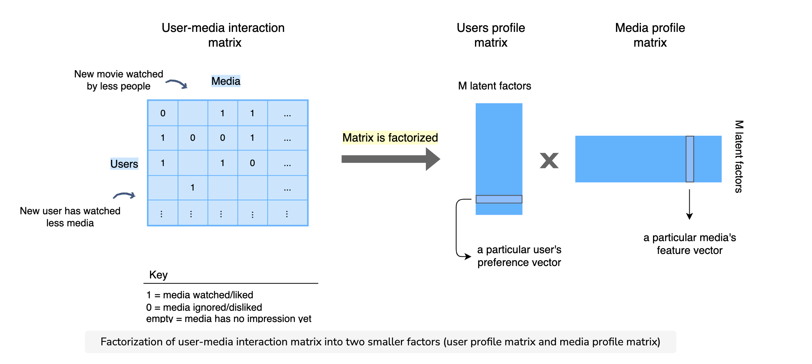
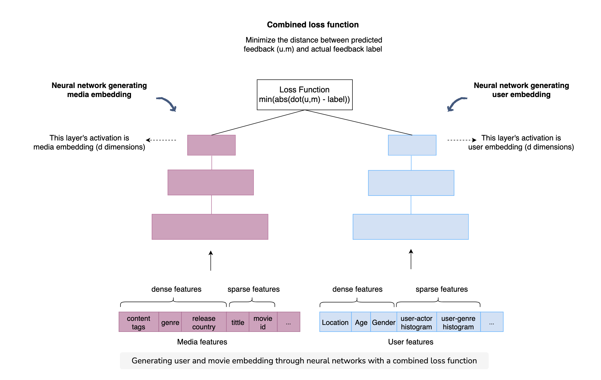

### [Link](https://www.educative.io/courses/grokking-the-machine-learning-interview/YQZR9pOMXJ9)

* \[Skipping to candidate generation step]

#### Candidate generation techniques
1. Collaborate filtering
  * suffers cold start problem
2. Content-based filtering
  * no real cold start problem (or not as bad) 
3. Embedding-based similarity
  * cold start problem

##### Collaborative filtering
* Sub-options:
  1. nearest neighbor to predict how $user_{A}$ might like $candidate_{A}$
  2. matrix factorization
* Obviously 1 is computationally expensive to continue to compute similar users
* For 2, recall for matrix factorization we:
  * represent a user-media interaction matrix of size $uxp$ for $u$ users and $p$ products
  * want to factorize it as a product of a $uxM$ & $Mxp$ matrices = user profile matrix with $M$ latent facors and product profile matrix with $M$ latent factors
  * then we can take the dot product between a given row user-vector and column media vector to get a similarity and prediction score
  * to learn
    * initialize vectors randomly
    * difference between the actual known interaction and the predict is the error $e_{i,j} = f_{i,j} - u_{i}*m_{j}$
    * update weight vectors via stochastic gradient descent

##### Content-based filtering
* basic heuristic, dot-product, logistic regression, etc.

##### Embeddings
* Given historical feedback between user and a movie product, use deep learning to generate latent vectors/embeddings to represent both movies and user
* Embedding generation:
  1. Set up network as two towers. One tower feeding in media only sparse and dense features and other with user-only sparse and dense features.
  2. Activation of the first tower's last layer will form the media vectors embedding
  3. Activation of the second tower will form user's vector embedding
  4. Combined optimization function at the top aims to minimize distance between the dot product of u and m
  5. To get candidates, since the user and movie embeddings are in same space, compute the kNN for the user for the movie specific embeddings

  

#### Data imbalance
* randomly downsample negative class
* can also weight exampled (e.g., if binary watch/don't watch), but overall want to maximize user watch time, then you could weight samples where user watched and watched for longer period

#### Train test split
* given time dimension in feature, train on earlier part of week and validate/test on later part

#### Ranking
* pass serving features at eval time as usual
* one option is for re-ranking: i.e., take top 10 recs from model and re-rank the results
  * here you could random sort, or take only N from each genre like comedy
  * this keeps recommendations fresh and diverse
