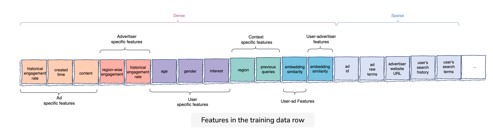

### [Link](https://www.educative.io/courses/grokking-the-machine-learning-interview/N0P4R1v8mXL)

#### Metrics
* compared to other prediction tasks, ad prediction requires calibration-sneitive metrics for auction
  * log loss (i.e., cross-entropy loss) is able to be useful here
  * absolute measure of quality, which accounts for generating well-calibrated, probabilistic output
* online metrics = overall revenue
  * click rate
  * downstream action rate
  * blowback: hide ad, report ad, etc.

#### Architectural Components
* Ads selection (similar to candidate generation)
* Ads prediction
* Auction: take top K relevant ads and bids. For every ad request, an auction takes place to determine which ads to show. The top relevant ads selected by the ads prediction system are givne as input to Auction. Auction then looks at total value based on an ad's bid as well as its relevance score. An ad with the highest total value is the winner for the auction. The total value depends on the following factors:
  * bid: amount advertsier is willing to pay
  * user engagement rate estimate
  * ads quality score: assessment of the quality of the ad
  * budget
* $Ad\\ rank\\ score = Ad\\ predicted\\ score\\ *\\ bid#
* then calculate cost per engagement and cost per click based on actual observation
* Pacing: important to not drain an advertisers entire budget over a short time period

#### Features
* main entities: ad, advertiser, user, context
  * ad specific features
  * advertiser specific features
  * user specific features
  * context specific features
  * user-ad cross features
  * user-adversiter cross features

#### Training
* negative downsample given great class imbalance
* however our predicted model output will now be in the downsampling space
* as a result, the auction will use an incorrect prediction rate to determine pricing and so we need to recalibrate $q = \dfrac{p}{p+(1-p)/w}$

**train test split**
* need to be mindful that user engagement patterns may differ throughout the week
* random splitting would result in utilizing future data for prediction given our data has a time dimension (i.e., we can utilize engagement on historical ads to predict future ad engagement). Hence w ill train the model on data from one-time interval and validate on another

#### Prediction nuance
* temporal component is key, we are likely to observe log-loss increase as days-since-training increases
* practical approach is to keep refreshing the model with the latest impressions and enagements after regular internals (i.e., online or activ elearning)
* logistic regression easily supports this approach
  * but this requires manual,  complex effort to create feature crosses
  * to get around this we can use features from an additive tree (like GBT)
  * if 100 trees --> 3 leaf nodes in each --> binary vector of size 400 with 100 1's
  * can do something similar with NN where output of last node of hiddne layer is used as feature vector then input into logistic regression
