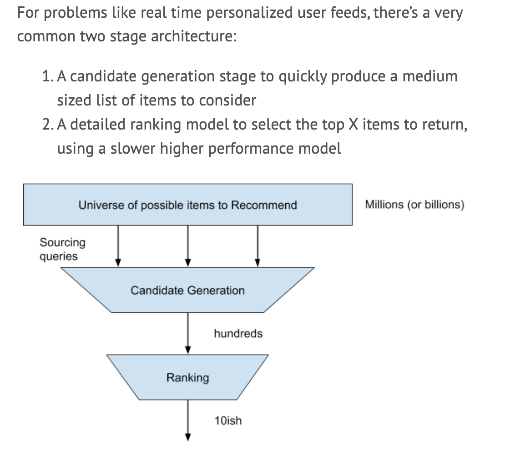

### [Blog](http://patrickhalina.com/posts/ml-systems-design-interview-guide/)

#### Steps

1. Product Objectives and Requirements Clarification

* do not dive into a solution
* clarify the business/product priorities
* translate goals into systems objectives (e.g., "increase engagement" --> break down into new user tention, increasing session length, etc.)
* north star?
* show some product sense

* product requirements: real time or batch? all user segments? how many users? how quickly?
  * how many items?
  * peak requests per second? day?
  * SWAG SLAs

* call out assumptions

2. High Level Design
* often times, there is a well known high level industry approach
* look for buy in from interviewer along the way

* **real time, pre calculated batch, or hybrid?**
* one of the most important design decisions
* real time systems limit complexity, while batch have issues with staleness and new users

* for real time presonalized user feeds, very common two stage architecture

3. Data Brainstorming and Feature Engineering
* two useful signals to provide: ability to think of useful data to feed into model
* knowledge about transforming raw signals into usable numeric features for model

* hint: this is something you can think about ahead of time!
  * for company you're interview at, think about the useful data sources and features you could use

**Data Sources**
* High level sources of signals, e.g., for youtube video search:
  * user features
  * each video that can be recommended
  * interactions between user and video
  * search query

**High Level Features**
* Within each data source, iterate on the types of feature available. Useful to call out specific features, but do not need to be exhaustive. E.g., for a facebook user:
  * demographics: age, gender, nationality, language
  * session: time in session, number of items viewed
  * post history: items liked, items disliked, posts created
  * friends/following: how many friends do they have, posts liked, interested followed
* Don't leave feature as "history of items liked", because that's not numeric that can be used. Be slightly more specific.

**Feature Representation**
* Now, discuss actual numeric representations
* There's so many potential features, pick a subset that provides evidence of ability. Some common techniques:
  * numeric values: demeaning, scaling, removing outliers, binning, quantization
  * categorical values: if maybe ~10-20 features, one-hot-encode. If high cardinality, use embedding layer
  * text: common NLP concepts good, understand how we can use BERT and Word2Vec. Don't need to be expert, but a bit of knowledge of common techniques
  * complex: how can you represent complex items like a user's history of viewed posts as a numeric vector? Similar to text embeddings, you can build up a feature by representing each post as its own embedding, then combining embeddings (through aggregation or concatenation)
* Call out why we are doing some of these? E.g., why embeddings? why normalize?

**Feature Selection**
* Not always good idea to throw kitchen sink at model
* Discuss techniques for feature importance ranking and selection
* Discuss regularization

**Candidate Sources**
* Heuristic to generate initial list of candidates
* Give examples?
  * items that are "close" to user in embedded space
  * items similar to past interactions
  * items that are popular across large group
* Be creative

**Infrastructure**
* Some companies care about this more than others. Try to guage expectations.
* See section below

4. Model Development**
* Good to cover some breadth instead of naming one solution

**Model Types**
* Moving from higher levels of abstractions to more specific
* Break down higher level components into lower level ML model types:
  * binary classifiers
  * multi-classifers
  * regressions

* For our ranking components, see have options. E.g.,
  * binary classifier that predicts whether user will interact with post
  * multi classifier that predicts for things like commenting, liking, or hiding a post
  * regression that predicts number of interactions a user will make with post

**Offline Training and Evaluation**
* Models trained and evaluated offine
* Discuss data you'll use for training
* How many days?
* What about class imbalance?
* How to organize eval data, k-fold? holdout?
* Metrics you would use to compare models
* Discuss how it might affect user experience to have a "false positive" vs. missing the "right" answer

**Modeling Techniques**
* Now we have inputs and expected outputs
* Discuss actual implementation
* Suppose binary classifier. Discuss a few modeling techniques:
  * Logistic regression: fast to train, compact, linear relationship
  * Gradient boosted trees: better performance, can find non-linear interactions, typically doesn't require much tuning
  * Deep Neural Networks: produce state of the art solutions, deals with non-linearities, requires lots of tuning and computing resources to train

* Bring up advanced issues specific to these models. E.g., for logistic regression --> regularization with lasso or adding interaction features to deal with non-linearity.
* If uses an optimizer, talk about the loss functions you can use
* Talk about hyper-parameters and design choices for each model. Show off depth and go beyond shallow ideas

**Online Evaluation**
* Trained model and know hyperpameters for holdout data. Do we launch to everyone?
* Talk about how we would launch system. Aka, probably A/B testing.
* Talk about nuances especially with metrics and statistical tests you'd perform (e.g., t-test)
* Talk about ramping patterns and issues that arise with A/B testing

**Model Lifecycle Management**
* Once launched, what other ops work is there?
* How can we monitor model to make sure it's healthy and what operations we will have to keep model performing well
* What happens if we want to update features?

5. Leveling
* Goes a long way to determining junior, senior, staff. Here are a few detailed areas that show experience:
  * business/product considerations (e.g., cannibalizing revenue or engagement)
  * model lifecycle management (detecting feature drift, performance drop)
  * updating data (e.g., embeddings)
  * how to split up work between workers or teams
  * measuring effects on business
  * offline and online evaluation
  * data issues, remediation, skewed data, seasonality

6. Quick Cheat Sheet
* Offline objectives
  * distances (cosine, dot, jaccard, levenshtein)
  * precision, recall, f1, calibration
  * RMSE, ranking, maps, SSE
  * ranking: NDCG

* Online evaluation
  * A/B testing
  * Business KPIs: revenue, retention, engagement

* Feature engineering
  * Continuous: demean, normalize
  * Discrete: one-hot, embeddings
  * Embeddings
  * PCA

* Training
  * train, validation, test sets
  * k-folds cv
  * training sample selection (e.g., negative sampling)

* Models
  * linear regression
  * boosted trees
  * deep learning

* Deep learning
  * theoretical background: optimizers, gradient descent, back prop
  * e.g., Adam = stochastic gradient descent, look into this more

* Recommendation Systems
  * collaborative filtering
  * candidate selection
  * ranking metrics

7. Infrastructure Components
* Should be able to talk about infra you could use to implement solutions. These help meet the scale and timing SLAs you would have gathered earlier.
  * database and distributed data systems like spark
  * serving systems (TFX)
  * model tracking and management systems (kubeflow)

8. Embeddings
* Don't treat like a black box. Can you embed user and item in the same space? How can you combine embeddings? Do you need to "retrain" your embeddings if new item is added to catalog? Do you need deep learning?

9. Nearest Neighbours
* Understand how these can be used in ranking
* Understand LSH

10. Deep Learning
* Know major concepts and how they fit together? Different between gradient descent, back prop, and optimizers like Adam
* Common activation functions? What loss function will we use?
* What's your process for hyperparameter selection?
* What are some key hyper params and design choices?
* How can we use transfer learning?
* Can you describe techniques like batch norm or l1/l2 penalities?
* Be familar with cutting edge architectures and high level understanding
  * wide and deep
  * transformers
  * inception modules

11. Pre Interview Checklist
* Be familiar with core ML concepts and ifnra
* Go over questions and requirements gathering
* Prepare the flow for how you'll discuss design
* Brainstorm user features, item features, and sources of data signals
* Make sure you understand main entities. E.g. if Pinterest, look at what's in the homefeed, understand what a Pin is, how users interact, etc.
